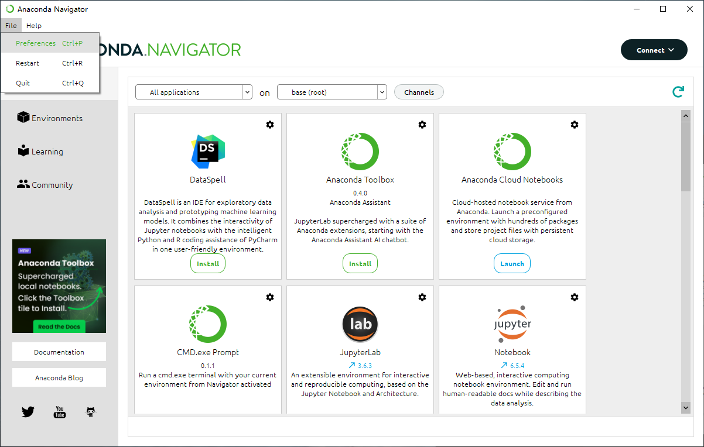
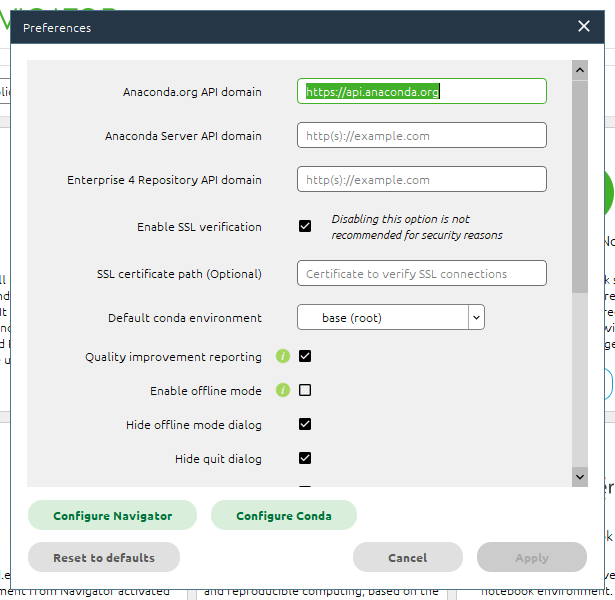
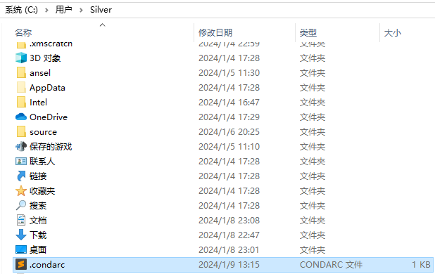

## Conda源配置

#### 1、查看conda当前配置 

#### 查看当前conda完整设置信息

``` cmd
conda info
```


#### 查看当前镜像Channels

``` cmd
conda config --show channels
```


#### 2、配置清华镜像源

``` cmd
conda config --add channels https://mirrors.tuna.tsinghua.edu.cn/anaconda/pkgs/free/
conda config --add channels https://mirrors.tuna.tsinghua.edu.cn/anaconda/pkgs/main/
# (可选)设置搜索时显示通道地址
conda config --set show_channel_urls yes
```

也可以在C:\Users{用户名}\目录下的`.condar`文件中添加如下部分
channels:
  - defaults
show_channel_urls: true
default_channels:
  - https://mirrors.tuna.tsinghua.edu.cn/anaconda/pkgs/main
  - https://mirrors.tuna.tsinghua.edu.cn/anaconda/pkgs/r
  - https://mirrors.tuna.tsinghua.edu.cn/anaconda/pkgs/msys2
  custom_channels:
    conda-forge: https://mirrors.tuna.tsinghua.edu.cn/anaconda/cloud
    msys2: https://mirrors.tuna.tsinghua.edu.cn/anaconda/cloud
    bioconda: https://mirrors.tuna.tsinghua.edu.cn/anaconda/cloud
    menpo: https://mirrors.tuna.tsinghua.edu.cn/anaconda/cloud
    pytorch: https://mirrors.tuna.tsinghua.edu.cn/anaconda/cloud
    pytorch-lts: https://mirrors.tuna.tsinghua.edu.cn/anaconda/cloud
    simpleitk: https://mirrors.tuna.tsinghua.edu.cn/anaconda/cloud
    deepmodeling: https://mirrors.tuna.tsinghua.edu.cn/anaconda/cloud/

#### 3、恢复默认源

```cmd 
conda config --remove-key channels
```

## 环境操作

#### 1、创建环境

``` cmd
conda create --name <env_name> <package_names> python=3.9
```

注意：

- `<env_name>`即创建的环境名。建议以英文命名，且不加空格，名称两边不加尖括号“<>”。
- `<package_names>`即安装在环境中的包名。名称两边不加尖括号“<>”。

1. 如果要安装指定的版本号，则只需要在包名后面以`=`和版本号的形式执行。如：`conda create --name <env_name> python=2.7`，即创建一个名为“python2”的环境，环境中安装版本为2.7的python。
2. 如果要在新创建的环境中创建多个包，则直接在`<package_names>`后以**空格**隔开，添加多个包名即可。如：`conda create -n python3 python=3.5 numpy pandas`，即创建一个名为“python3”的环境，环境中安装版本为3.5的python，同时也安装了numpy和pandas。

- `--name`同样可以替换为`-n`。

提示：默认情况下，新创建的环境将会被保存在`/Users/<user_name>/anaconda3/env`目录下，其中，`<user_name>`为当前用户的用户名。

#### 2、激活及切换环境

``` cmd
conda activate <env_name>
```

conda config --add pkgs_dirs D:\ProgramApplication\Anaconda\pkgs 
conda config --add envs_dirs D:\ProgramApplication\Anaconda\envs

#### 3、更改Anaconda默认安装位置

常用的有三种，前两种本质都是修改.condarc配置文件，第三种是将文件路径添加的

###### 3.1 使用Anaconda Navigator更改

打开Nanconda Navigator



左上角 File -> Preferences或者使用ctrl+P快捷键



点击 Configure Conda


在其中添加

``` cmd
envs_dirs:
  - D:\AnacondaEnvironment\envs
pkgs_dirs:
  - D:\AnacondaEnvironment\pkgs
```

###### 3.2 修改`.condarc`配置文件进行更改

(1) 在`C:\Users\Username`路径下找到 `.condarc`文件


(2) 使用记事本或者其他方式打开进行编辑

``` cmd
channels:
  - defaults
envs_dirs:
  - D:\AnacondaEnvironment\envs
pkgs_dirs:
  - D:\AnacondaEnvironment\pkgs
```

###### 3.3 使用指令将文件路径进行添加

打开AnacondaPrompt，执行

``` cmd
conda config --add pkgs_dirs D:\ProgramApplication\Anaconda\pkgs 
conda config --add envs_dirs D:\ProgramApplication\Anaconda\envs
```
