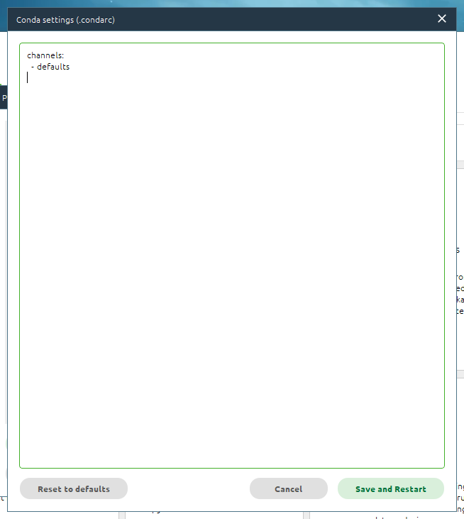

## 1.Anaconda下载

#### 

[官网地址   Anaconda ](https://www.anaconda.com/)


点击Free Download默认根据平台下载最新版本


你也可以点击

跳转或者手动下拉到该界面最下面选择不同平台的版本，支持WIN/MAC/Linux


开始下载安装包，后续以2023.09-0-Windows-x86_64进行演示


## 2.Anaconda安装


耐心等待，大概在10min以内

安装完成后测试，打开**Anaconda-Navigator**，若正确打开，则说明Anaconda安装成功，否则请检查安装步骤；
我们平时用的更多的是**Anaconda Prompt**
按 win打开开始可以找到Anaconda Prompt，或者使用win+s搜索Anaconda Prompt打开
在打开的dos窗口内输入`conda list` 查看默认的base环境的库情况

若没有异常，则说明Anaconda安装成功，未来我们也大多使用该Prompt框进行不同Conda环境的创建和配置工作，可以理解为使用不同python环境的cmd

1. 前往[官方下载页面](https://link.zhihu.com/?target=https%3A//docs.anaconda.com/anaconda/install/windows)下载。有两个版本可供选择：Python 3.6 和 Python 2.7，选择版之后根据自己操作系统的情况点击“64-Bit Graphical Installer”或“32-Bit Graphical Installer”进行下载。
2. 完成下载之后，双击下载文件，启动安装程序。

- 注意：

① 如果在安装过程中遇到任何问题，那么暂时地关闭杀毒软件，并在安装程序完成之后再打开。

② 如果在安装时选择了“为所有用户安装”，则卸载Anaconda然后重新安装，只为“我这个用户”安装。

3. 选择“Next”。
4. 阅读许可证协议条款，然后勾选“I Agree”并进行下一步。
5. 除非是以管理员身份为所有用户安装，否则仅勾选“Just Me”并点击“Next”。
6. 在“Choose Install Location”界面中选择安装Anaconda的目标路径，然后点击“Next”。

- 注意：

① 目标路径中**不能**含有**空格**，同时不能是**“unicode”**编码。

② 除非被要求以管理员权限安装，否则不要以管理员身份安装。


7. 在“Advanced Installation Options”中**不要**勾选“Add Anaconda to my PATH environment variable.”（“添加Anaconda至我的环境变量。”）。因为如果勾选，则将会影响其他程序的使用。如果使用Anaconda，则通过打开Anaconda Navigator或者在开始菜单中的“Anaconda Prompt”（类似macOS中的“终端”）中进行使用。

除非你打算使用多个版本的Anaconda或者多个版本的Python，否则便勾选“Register Anaconda as my default Python 3.6”。

然后点击“Install”开始安装。如果想要查看安装细节，则可以点击“Show Details”。


8. 点击“Next”。
9. 进入“Thanks for installing Anaconda!”界面则意味着安装成功，点击“Finish”完成安装。

- 注意：如果你不想了解“Anaconda云”和“Anaconda支持”，则可以**不勾选**“Learn more about Anaconda Cloud”和“Learn more about Anaconda Support”。


10. 验证安装结果。可选以下任意方法：

① “开始 → Anaconda3（64-bit）→ Anaconda Navigator”，若可以成功启动Anaconda Navigator则说明安装成功。

② “开始 → Anaconda3（64-bit）→ 右键点击Anaconda Prompt → 以管理员身份运行”，在Anaconda Prompt中输入 ***conda list\*** ，可以查看已经安装的包名和版本号。若结果可以正常显示，则说明安装成功。

## 3. 更改Anaconda默认安装位置

常用的有三种，前两种本质都是修改.condarc配置文件，第三种是将文件路径添加的

#### 3.1 使用Anaconda Navigator更改

打开Nanconda Navigator


左上角 File -> Preferences或者使用ctrl+P快捷键


点击 Configure Conda


在其中添加
``` cmd
envs_dirs:
  - D:\AnacondaEnvironment\envs
pkgs_dirs:
  - D:\AnacondaEnvironment\pkgs
```

#### 3.2 修改`.condarc`配置文件进行更改

(1) 在`C:\Users\Username`路径下找到 `.condarc`文件


(2) 使用记事本或者其他方式打开进行编辑
``` cmd
channels:
  - defaults
envs_dirs:
  - D:\AnacondaEnvironment\envs
pkgs_dirs:
  - D:\AnacondaEnvironment\pkgs
```

#### 3.3 使用指令将文件路径进行添加

打开AnacondaPrompt，执行
``` cmd
conda config --add pkgs_dirs D:\ProgramApplication\Anaconda\pkgs 
conda config --add envs_dirs D:\ProgramApplication\Anaconda\envs
```


