# CUDA和CUDNN安装教程及CUDA多版本安装切换

## 一、简单介绍

#### **Cuda**

**CUDA**（Compute Unified Device Architecture, **统一计算设备架构**)
是由显卡厂商**NVIDIA**推出的通用并行计算架构，该架构使GPU能够解决复杂的计算问题。
与**中央处理器**（Central Processing Unit, **CPU**）相对，**图形处理器**（Graphics Processing Unit, **GPU**）是**显卡**的核心芯片。而cuda正是英伟达开发的GPU（N卡）的编程接口。

#### **CUDNN**

（CUDA Deep Neural Network library，**CUDNN**）是用于深度神经网络的GPU加速库。它强调性能、易用性和低内存开销。NVIDIA cuDNN可以集成到更高级别的机器学习框架中，如谷歌的Tensorflow、加州大学伯克利分校的流行caffe软件。简单的**插入式设计**可以让开发人员专注于设计和实现神经网络模型，而不是简单调整性能，同时还可以在GPU上实现高性能现代并行计算。
cuDNN是基于CUDA的深度学习GPU加速库，有了它才能在GPU上完成深度学习的计算。

## 二、安装前的确定工作：

#### **确保你的电脑使用的是NVIDIA独立显卡！**

#### 1：查看显卡驱动支持的最高CUDA的版本及显卡驱动版本

以便下载对应的CUDA安装包，CUDA版本采用**向下兼容**（例如如果你的显卡驱动支持的最大CUDA版本为11.8，则你只能选择11.8及以下的CUDA版本），
下载的CUDA版本需要的最低显卡驱动版本对应见：[NVIDIA CUDA Toolkit Release Notes ](https://docs.nvidia.com/cuda/cuda-toolkit-release-notes/index.html)
**注：现在CUDA安装程序选择自定义安装会有自动安装对应最低显卡驱动版本，只要使用的是近几年的如RTX系列独立显卡，基本不会遇到CUDA和显卡驱动版本不匹配的问题，详细见第四部分 下载安装CUDA**

###### 查看自己的显卡驱动版本

两种方法：

###### 1.借助**NVIDIA控制面板**查询

桌面鼠标右键，打开**NVIDIA 控制面板**

帮助 -> 系统信息
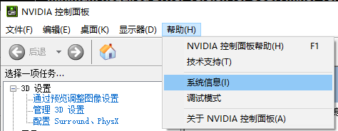

=

###### 2.使用cmd指令进行查询

在显卡驱动正确安装的情况下，cmd输入`nvidia-smi.exe`

两种方法均可查询到目前的显卡驱动版本，及最高支持的CUDA版本
**注意：提到这个问题主要是针对旧显卡及就显卡驱动的情况，一般RTX 20系及以上只要确保显卡驱动保持最新更新，一般没有太大问题。**
**另外如果你要使用Pytorch的某个具体版本，还要根据Pytorch版本来确定要下载的CUDA版本，推荐CUDA11.8。**
**实际上，一台电脑上是可以安装多个CUDA版本并可以通过环境变量路径来进行切换使用的，会在该文最后部分进行提及。**

#### 2：查看对应CUDA对应的VS版本并提前安装好VS

下载并安装对应的VS版本且安装好C++桌面开发模块，在安装CUDA之前要提前安装好VS，安装的流程是VS->CUDA->CUDNN，如果没弄清楚那就安装第四部分，安装最新年份的Visual Studio 社区版就好。

#### 3：确定CUDA版本对应的cuDNN版本

这个不需要特别注意，在cudnn的下载页面会列出每个版本对应的cuda版本，详细见第五、CUDNN的安装部分

## 三、下载安装VS2022

需要先下载Visual Studio 并下载其中的C++开发模块，已经有其他版本VS且下载C++开发模块的可以跳过直接进行CUDA的安装及下载

#### 下载Visual Studio 2022社区版在线安装器，[Visual Studio Community 2022 在线下载器 下载链接](https://c2rsetup.officeapps.live.com/c2r/downloadVS.aspx?sku=community&channel=Release&version=VS2022&source=VSLandingPage&cid=2030:24c455ba0de54a5bad97e6bfe55d93b5)

下载后运行，等待安装
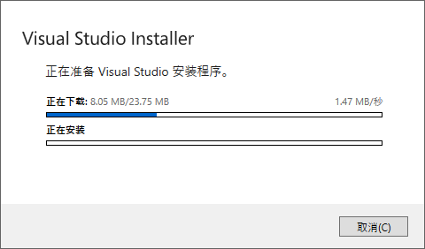

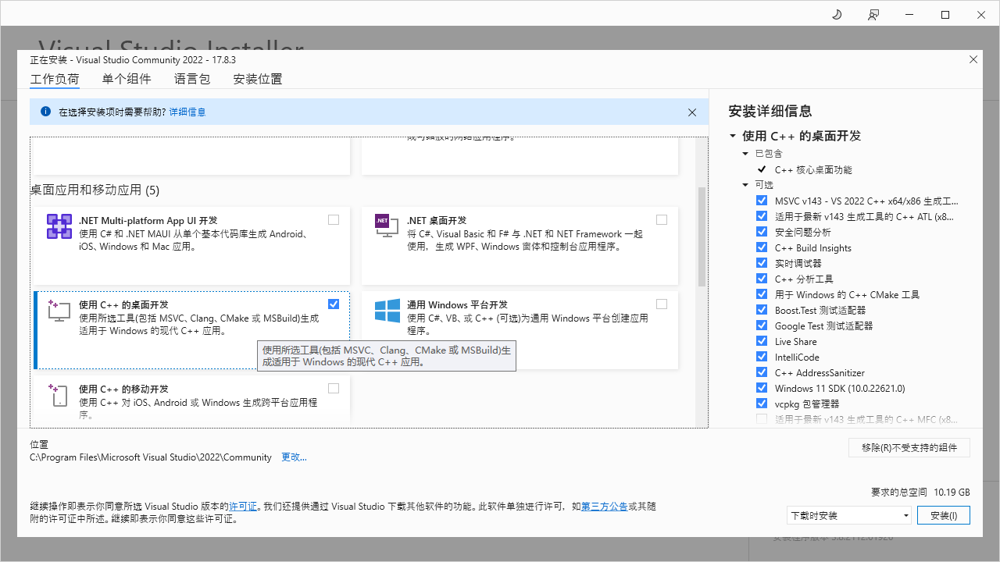
**一定要勾选下载C++桌面开发**，位置可自定义，其他按照自己需求，勾选后点击左下角安装，自动安装，但要在线下载，请耐心等待~

## 四、下载安装CUDA

演示以CUDA11.8为例

#### 下载CUDA下载地址：[CUDA Toolkit Archive | NVIDIA Developer](https://developer.nvidia.com/cuda-toolkit-archive)

选择你要安装的CUDA版本下载

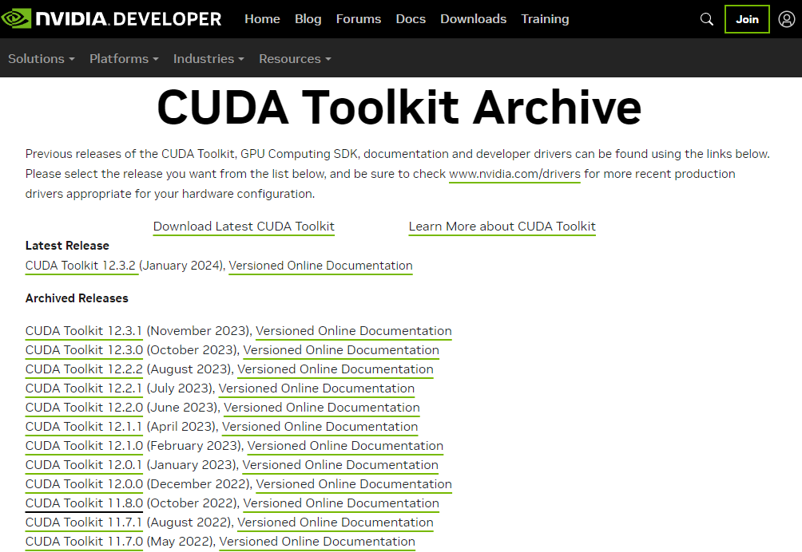

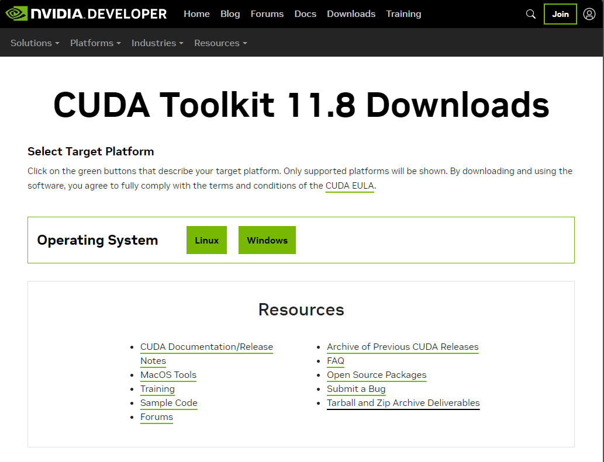

> 如果向下图，仅出现Resources部分则说明网络问题还没加载出来，请等待或者尝试刷新网页。
> 

**依次选择你的系统平台及版本，选择exe(local)下载完整包**
           

​           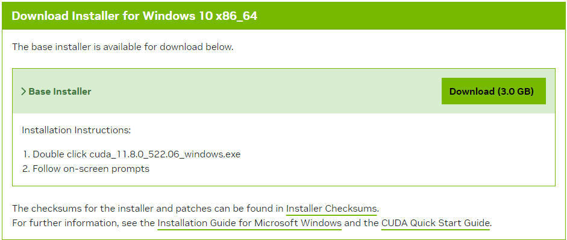 
**点击Download，等待安装包下载完成**
安装开始走流程

这个路径不用管就好，只是安装程序临时解压的缓存位置

等待安装程序解压，建议安装过程中关闭如360/电脑管家/火绒等各类杀毒软件

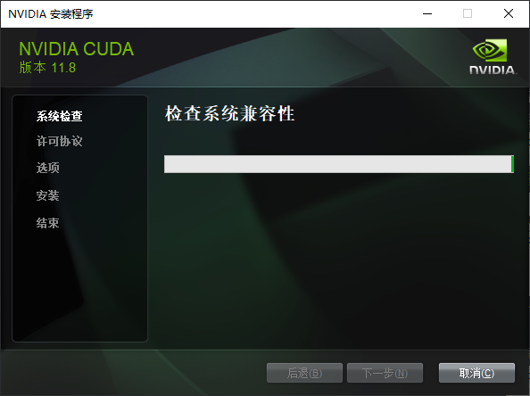
同意并继续
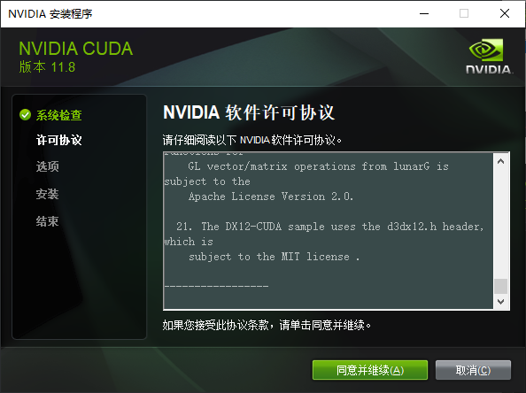
接下来有两种安装选项，一个是精简安装，一个是自定义安装。
推荐精简安装就好，点击下一步
注意：**精简安装会安装CUDA相关组件，同时也会将显卡驱动重新安装**，如果不想重新安装显卡驱动，可以选择自定义安装，这里选择自定义安装。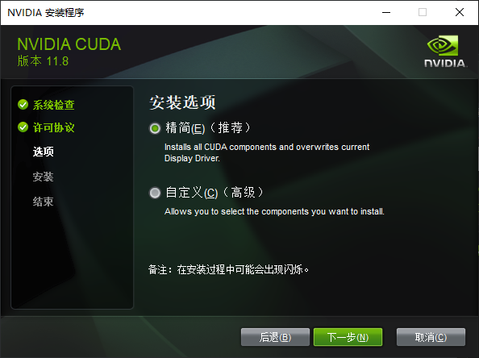
自定义安装点击下一步后要进行选择安装的组件，取消驱动组件安装
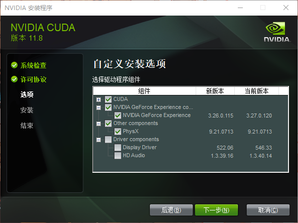
取消勾选Driver components部分，其实这里也可以看到安装CUDA的最低驱动版本，如果低于该版本会自动安装最低要求版本驱动，如果高于则不会进行操作。
点击下一步，自定义CUDA安装位置，如果你要改的话，记下来安装路径等下安装CUDNN需要将文件移动到该路径。
**下面的教程部分路径均为默认位置**
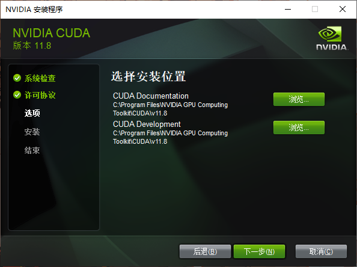

完成安装后，使用 `nvcc -V` 验证是否安装成功

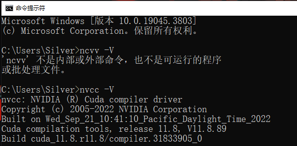
Build cuda_11.8 安装完成

## 五、下载安装CUDNN

下载CUDA下载地址：[CUDNN | NVIDIA Developer](https://developer.nvidia.com/rdp/cudnn-download)
这个地方需要注册NVIDIA会员，登录略
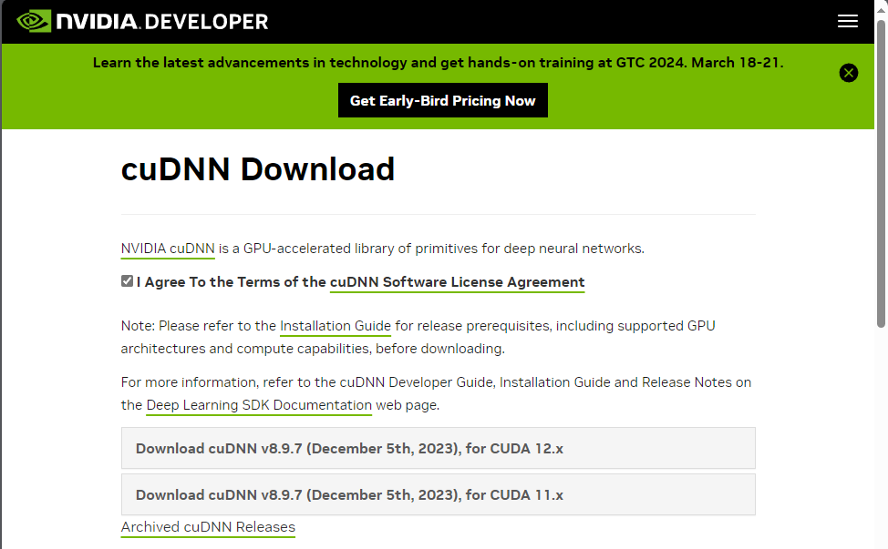

建议直接根据你的CUDA版本下载最新版本的cuDNN就好，需要特定历史版本点击左下角[Archived cuDNN Relaases]([developer.nvidia.com/rdp/cudnn-archive](https://developer.nvidia.com/rdp/cudnn-archive)),选择需要的版本下载，注意选择正确的For CUDA 版本。

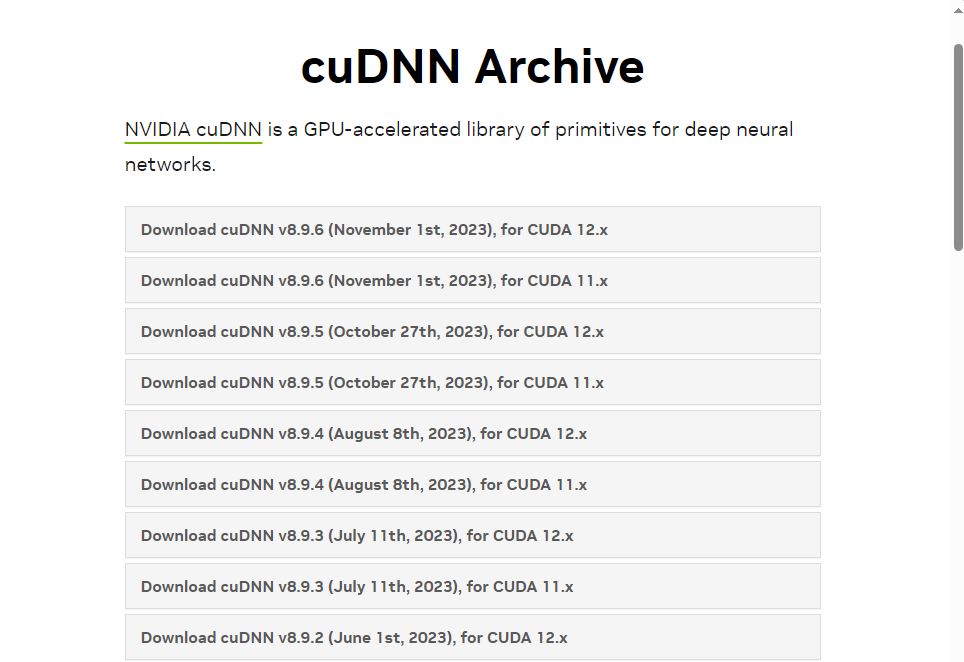~~注意下载的版本，以最新的cuDNN v8.9.7为例，如果安装的CUDA版本为12.0以上选择 [for CUDA 12.x](https://developer.nvidia.com/rdp/cudnn-download#a-collapse897-120)，如果CUDA版本为11.0-11.8(截至2024年1月)，则选择 [for CUDA 11.x](https://developer.nvidia.com/rdp/cudnn-download#a-collapse897-118)。~~

> ~~如果您显卡型号较旧，支持的CUDA版本较旧，能支持的cuDNN版本较低，请进入[cuDNN Archive | NVIDIA Developer](https://developer.nvidia.com/rdp/cudnn-archive),选择对应的cuDNN版本进行下载。但这样后续框架的下载和后期的工作，都有很大的限制和较高的难度。建议您更新自己的硬件显卡设备。~~

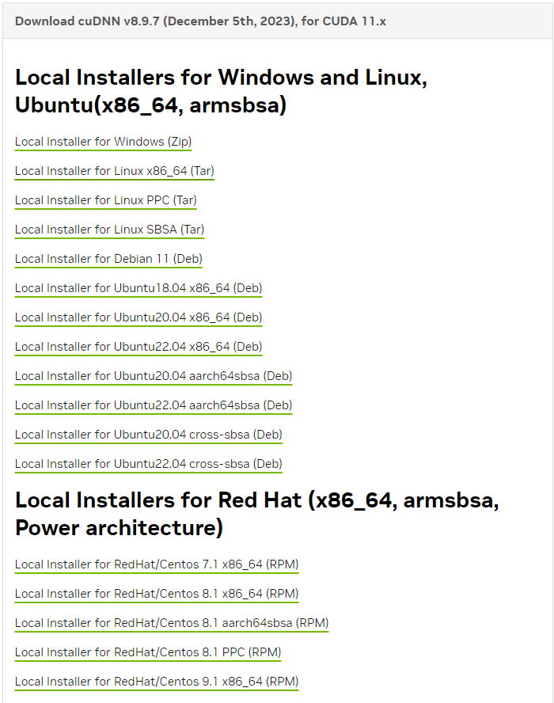

确顶下载的版本后点击，选择下载对应平台的压缩包，Windows选择第一个[Local Installer for Windows(ZIP)](https://developer.nvidia.com/downloads/compute/cudnn/secure/8.9.7/local_installers/11.x/cudnn-windows-x86_64-8.9.7.29_cuda11-archive.zip/)。
等待ZIP文件下载后使用解压软件进行解压

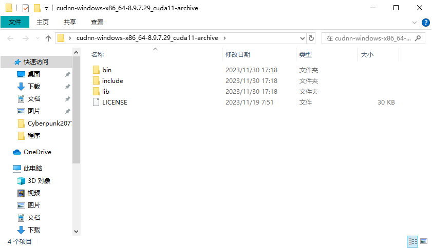

将前三个文件夹复制/移动到到CUDA的安装路径中（默认为：**`C:\Program Files\NVIDIA GPU Computing Toolkit\CUDA\v11.8`**）
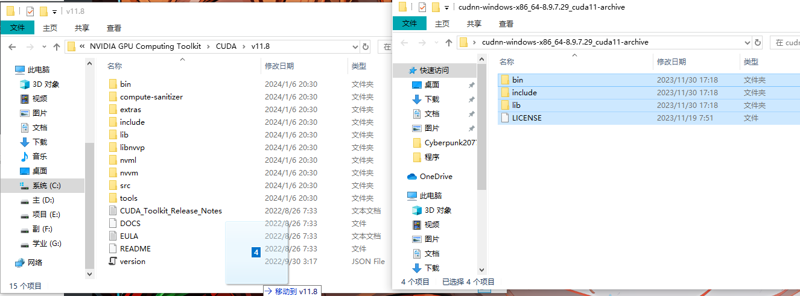

验证安装
通过NVIDIA提供的 `deviceQuery.exe` 和 `bandwidthTest.exe` 来查看GPU的状态，两者均在安装目录的 `extras\demo_suite`文件夹中

打开cmd，输入 `cd /d C:\Program Files\NVIDIA GPU Computing Toolkit\CUDA\v11.8\extras\demo_suite`
输入`deviceQuery.exe`运行exe程序查看CPU信息

输入`bandwidthTest.exe` 运行exe程序进行显卡带宽测试
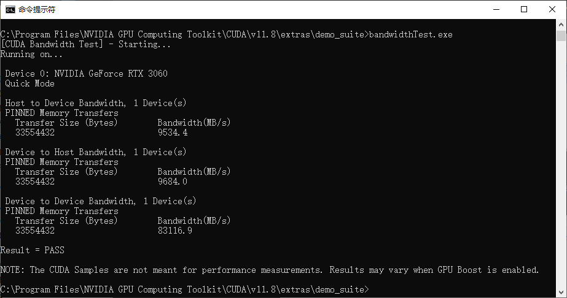

结果为Result=PASS，至此说明CUDA及cuDNN环境就全部安装完毕了。

## 六、多版本CUDA的安装和切换

有时候可能因为各种原因需要进行不同版本的CUDA切换，这可以通过系统环境变量优先级修改来实现。
之前我已经完成了CUDA 11.8 的安装，下面以切换到最新CUDA 12.3为例子。
完成CUDA 11.8 的安装后，打开系统环境变量，如图
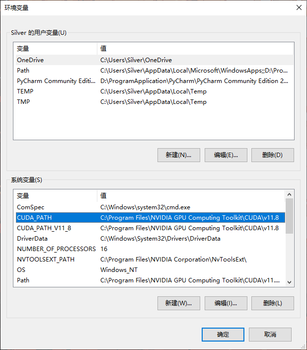

注意系统变量中的 `CUDA_PATH` ` CUDA_PATH_V11_8` 以及点击` Path`变量发现前面两列
C:\Program Files\NVIDIA GPU Computing Toolkit\CUDA\v11.8\bin
C:\Program Files\NVIDIA GPU Computing Toolkit\CUDA\v11.8\libnvvp

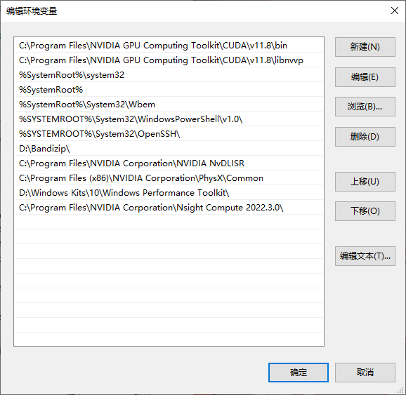

现在按照前面的步骤完成CUDA 12.3.2（包含cuDNN）版本的安装后再次打开
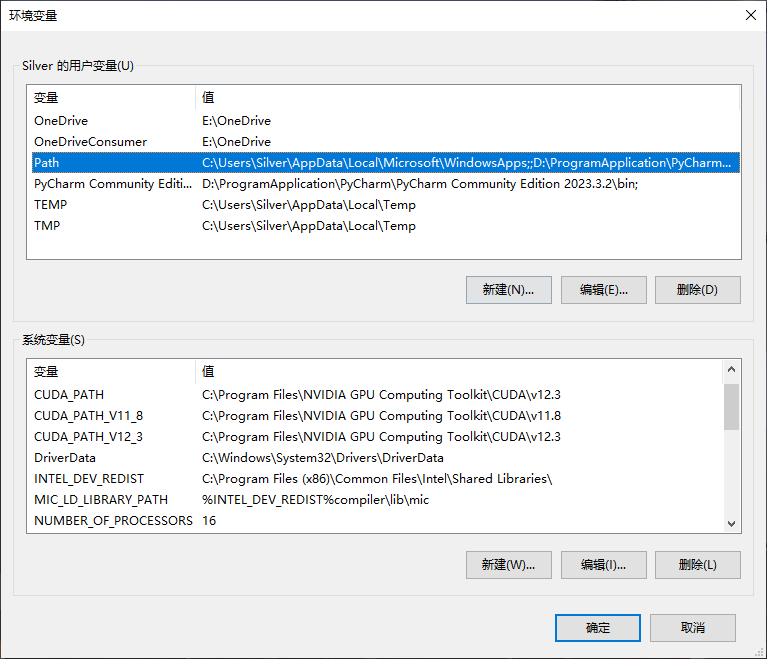
发现出现`CUDA_PATH_V12_3`，并且`CUDA_PATH`的路径也覆盖为v12.3，以及点击系统变量` Path`发现

前两列
C:\Program Files\NVIDIA GPU Computing Toolkit\CUDA\v12.3\bin
C:\Program Files\NVIDIA GPU Computing Toolkit\CUDA\v12.3\libnvvp
此时使用cmd`nvcc -V`指令显示使用cuda版本为12.3

如果想要恢复使用原来的CUDAv11.8

#### 需要**将系统变量中的`CUDA_PATH`改为`CUDA_PATH_V11_8`的路径** `C:\Program Files\NVIDIA GPU Computing Toolkit\CUDA\v11.8`，并**将系统变量Path中CUDAv11.8对应的两行上移到v12.3两行之前**，之后**重启电脑**。

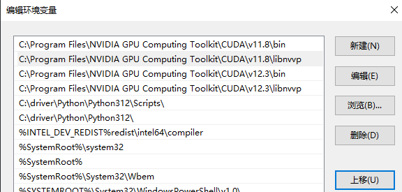
重启后再使用`nvcc -V`发现使用的CUDA版本变为V11.8，CUDA版本切换成功。
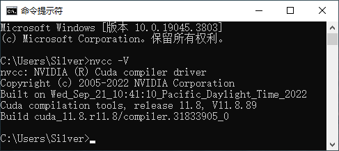