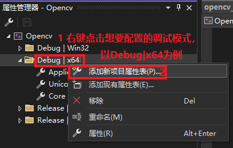

# Opencv 的下载安装和VisualStudio配置

## 1 opencv-windows的下载

#### 1.1 github直接下载链接(**需要外网链接**)

最新4.10.0版本的下载链接为：
https://github.com/opencv/opencv/releases/download/4.10.0/opencv-4.10.0-windows.exe

#### 1.2 官网下载其他版本

官网链接：https://opencv.org/releases/

可以选择你需要的版本，**注意下载用于Windows的exe安装包**。


下载打开exe文件后直接解压到安装路径，也可以先解压到Users\ $UserDownloads后移动到安装路径，我使用的安装路径为**C:\driver**，后续进行环境变量地址配置要用到安装路径。


## 2 Windows 环境变量配置

打开环境变量，编辑用户变量Path，新建环境变量路径为 `$opencv安装路径\opencv\build\x64\bin`，保存确定后重启电脑。


## 3 VisualStudio 项目配置

需要下载VisualStudio，下载地址：https://visualstudio.microsoft.com/zh-hans/，下面演示使用的是VS2022。

**打开项目解决方案属性页进行opencv的链接配置**


#### 3.1添加包含目录

在VC++ 目录进行包含目录的配置


配置路径为 (建议打开文件管理器直接复制路径)

opencv安装路径\opencv\build\include
opencv安装路径\opencv\build\include\opencv
opencv安装路径\opencv\build\include\opencv2   

这三个目录，PS：新版的opencv没有 ''opencv安装路径\opencv\build\include\opencv'' 这个路径，可以不添加。


#### 3.2添加库目录


配置路径为 opencv安装路径\opencv\build\x64\vc16\lib


#### 3.3添加依赖项


将 lib文件夹中的opencv_worldxxxd.lib 名称复制粘贴(PS:  不需要具体路径，xxx为版本号 d为debug)


**说明**：一定要添加`opencv_worldxxxd.lib`依赖，因为我们使用`vs`的时候是使用`debug`模式，在此基础上添加`opencv_worldxxx.lib`依赖也是可以的。

以上三种添加任务需要检查是否生效，如果添加失败就多试几次，配置完成后重启电脑。

#### 3.4 复制dll文件到系统路径

(PS：根据测试前面设置恰当无误的话，有时候不需要进行这一步复制就可以使用)

将`opencv_worldxxx.dll`和`opencv_worldxxxd.dll`两个文件复制到 `C:\Windows\SysWOW64`和`C:\Windows\System32`目录下


## 4 环境配置测试

进行环境配置的验证，新建一个cpp文件进行调试测试。
测试代码如下：

```c++
#include<opencv2/opencv.hpp>
#include<iostream>

using namespace cv;
using namespace std;

int main()
{
	Mat img = imread("xxx.jpg");//改成你电脑本机的图片地址，推荐使用绝对地址
	namedWindow("image", WINDOW_AUTOSIZE);
	imshow("image", img);
	waitKey(0);
	return 0;
}
```


选择`Debug` `x64`。


如果代码无报错可运行，说明配置成功。

## 5  其他项目的快速配置

#### 5.1 使用导出模板配置

如果需要经常做此类需要`OpenCV`环境的项目，就可以把设置导出模板，以后在创建项目时直接使用。


这样下次创建新项目时，可直接使用已经配置好的模板进行opencv环境的创建。


成功，后续就可以在创建新项目时快速配置模板。

#### 5.2 复制配置好的项目属性表文件到新项目

打开`属性管理器`。


右键Debug|x64 添加新项目属性表，(配置后可使用`Debug``x64`运行opencv，其他调试模式同理)。




在新建的属性页中按照3中的步骤进行配置，点击添加后在项目文件路径就能看到生成的 `opencv_x64_d.props`文件。


后续只需要将该文件复制到其他项目目录并添加到属性管理器中，就可以使用`debug` `x64`模式运行使用opencv库。


配置其他模式文件同理，注意属性表文件要和配置的调试模式对应。

## 后记

这篇笔记写在2025年12月，笔者考研二战失败为了面试工作重新熟悉配置opencv环境，整理出来希望能帮到后来者。

“今又携书剑，前路尽天关。
何日登云上了岸，回首无数山。
一人好得道，哪日苍生皆升天？
古来圣贤皆死绝，崎岖挡在前，
谁人道吾路，几剑开天门？
唯叹此间，同道少，
总是离别易，行路难。”
