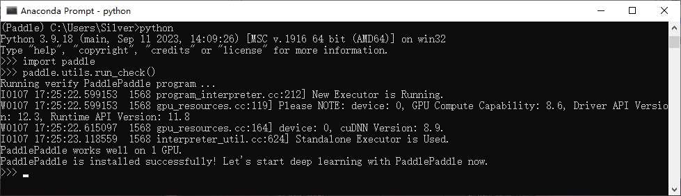

# PaddlePaddle环境搭建（Windows下的Conda安装）

## 1、前言

## 2、安装前准备

如果你要PaddlePaddle的GPU版本，在安装PaddlePaddle之前，请确定你已经正确地完成了CUDA和cuDNN的安装，并确定你的CUDA版本。

首先请根据[Windows 下的 PIP 安装-使用文档](https://www.paddlepaddle.org.cn/documentation/docs/zh/install/pip/windows-pip.html)确定支持的版本

> - 如果您的计算机没有 NVIDIA® GPU，请安装[CPU 版的 PaddlePaddle](https://www.paddlepaddle.org.cn/documentation/docs/zh/install/pip/windows-pip.html#cpu)
> - 如果您的计算机有 NVIDIA® GPU，请确保满足以下条件并且安装 GPU 版 PaddlePaddle
>   - **CUDA 工具包 11.2 配合 cuDNN v8.2.1，如需使用 PaddleTensorRT 推理，需配合 TensorRT8.2.4.2**
>   - **CUDA 工具包 11.6 配合 cuDNN v8.4.0，如需使用 PaddleTensorRT 推理，需配合 TensorRT8.4.0.6**
>   - **CUDA 工具包 11.7 配合 cuDNN v8.4.1，如需使用 PaddleTensorRT 推理，需配合 TensorRT8.4.2.4**
>   - **CUDA 工具包 11.8 配合 cuDNN v8.6.0，如需使用 PaddleTensorRT 推理，需配合 TensorRT8.5.1.7**
>   - **CUDA 工具包 12.0 配合 cuDNN v8.9.1, 如需使用 PaddleTensorRT 推理，需配合 TensorRT8.6.1.6**
>   - **GPU 运算能力超过 3.5 的硬件设备**
>   - 注：目前官方发布的 windows 安装包仅包含 CUDA 11.2/11.6/11.7/11.8/12.0，如需使用其他 cuda 版本，请通过源码自行编译。您可参考 NVIDIA 官方文档了解 CUDA、CUDNN 和 TensorRT 的安装流程和配置方法，请见[CUDA](https://docs.nvidia.com/cuda/cuda-installation-guide-linux/)，[cuDNN](https://docs.nvidia.com/deeplearning/sdk/cudnn-install/)，[TensorRT](https://developer.nvidia.com/tensorrt)

## 3、PaddlePaddle安装

### 3.1 创建虚拟环境

#### 3.1.1 安装环境

根据具体的 Python 版本创建 Anaconda 虚拟环境，PaddlePaddle 的 Anaconda 安装支持 3.8 - 3.12 版本的 Python 安装环境。
**$Your_Paddle_Env_name**：替换为环境名
**$YOUR_Python_Version**：替换为要使用的 Pyhon 版本

``` cmd 
conda create -n $Your_Paddle_Env_name python=$YOUR_Python_Version
```

#### 3.1.2 进入 Anaconda 虚拟环境

```cmd
conda activate $Your_Paddle_Env_name
```

### 3.2  在虚拟环境内进行安装

#### 3.2.1 查询对应的安装指令

PaddlePaddle支持PIP安装、Conda安装、Docker安装等诸多安装方式，可以使用[PP飞桨开始使用](https://www.paddlepaddle.org.cn/install/)网页，根据要使用的飞桨版本、操作系统、安装方式和计算平台获得安装指令。
**推荐直接在Anaconda 环境中使用PIP安装**
比如我使用 pip 方式下载 CUDA11.8 的 PaddlePaddle ：

``` cmd
python -m pip install paddlepaddle-gpu==2.6.0 -i https://pypi.tuna.tsinghua.edu.cn/simple
```

#### 3.2.2 （可选）添加清华源

对于国内用户无法连接到 Anaconda 官方源的可以按照以下命令添加清华源:

```cmd
conda config --add channels https://mirrors.tuna.tsinghua.edu.cn/anaconda/pkgs/free/
conda config --add channels https://mirrors.tuna.tsinghua.edu.cn/anaconda/pkgs/main/
conda config --set show_channel_urls yes
```

#### 3.2.3 执行安装指令

在激活的 Anaconda 虚拟环境内执行代码。


### 3.3 验证安装

安装完成后可以使用 `python` 或 `python3` 进入 python 解释器，输入`import paddle` ，再输入 `paddle.utils.run_check()`
如果出现`PaddlePaddle is installed successfully!`，说明已成功安装。
