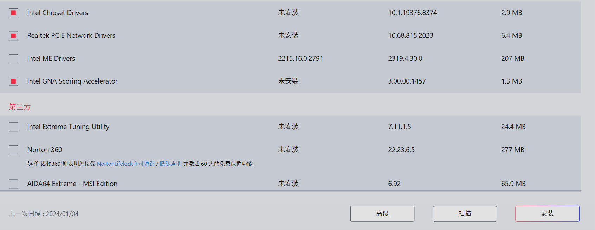
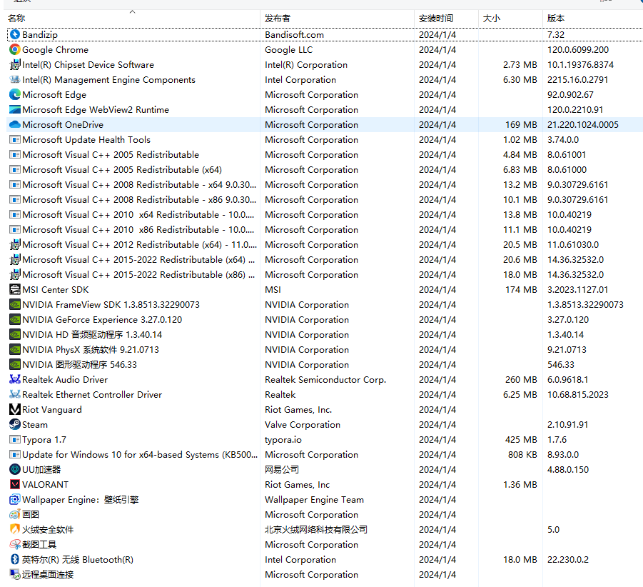
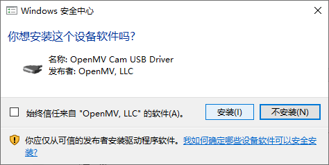
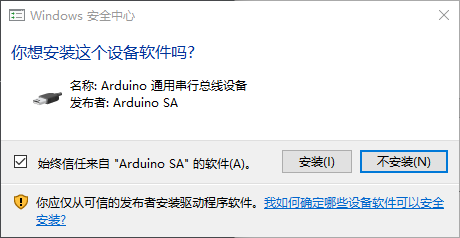
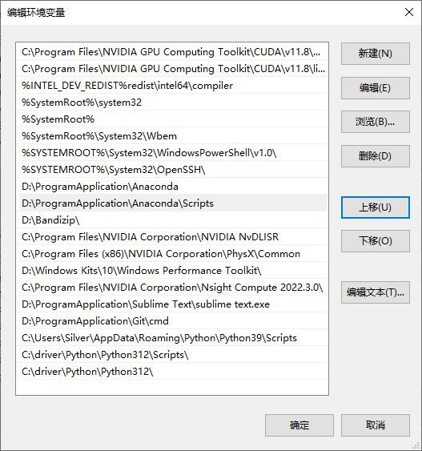

## 2024-1-4

重装系统






开始重启

## 2024-1-7

- anaconda 添加清华源

- 清除图标缓存

``` cmd
win+r->cmd->输入以下命令

taskkill /im explorer.exe /f

cd /d %userprofile%\appdata\local

del iconcache.db /a

start explorer.exe

exit
```

- Windows功能，成功安装.NET Framework 3.5(包含.NET 2.0 和 3.0)

- 安装python

- 修改清华源
  pip config set global.index-url https://pypi.tuna.tsinghua.edu.cn/simple

## 2024-1-8

- 安装格式工厂
- 安装UVR
- 安装Adobe Creative Cloud

  - AE
  - PR
  - Ps
  - Au

  使用Adobe-GenP-3.2.1破解

- 安装Openmv-IDE
  
  



## 2024-1-9

重装anaconda环境
重装系统Python版本更改为3.9.13
