# 1. 绪论

神经网络：一种以**（人工）神经元**为基本单元的模型
深度学习：一类机器学习问题，主要解决**贡献度分配问题**

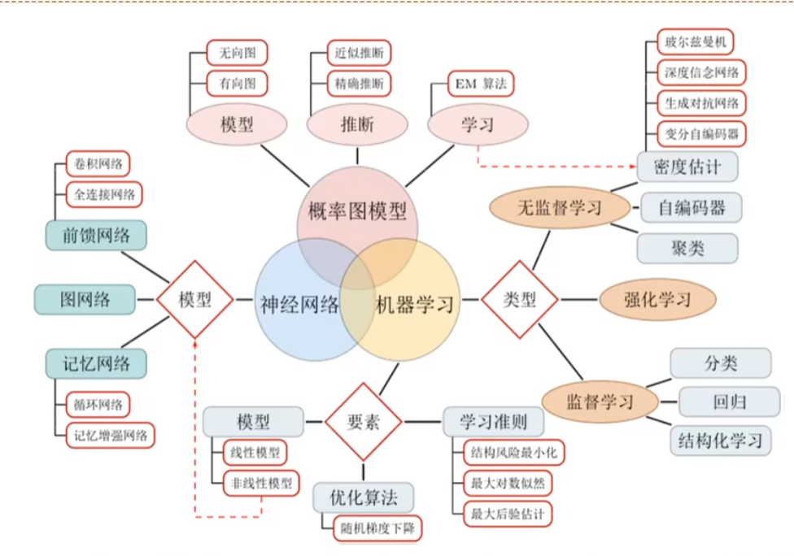

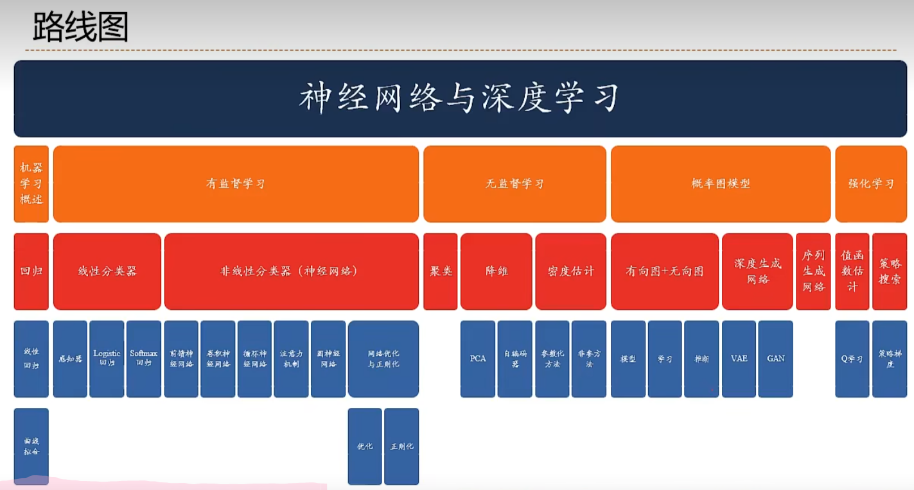

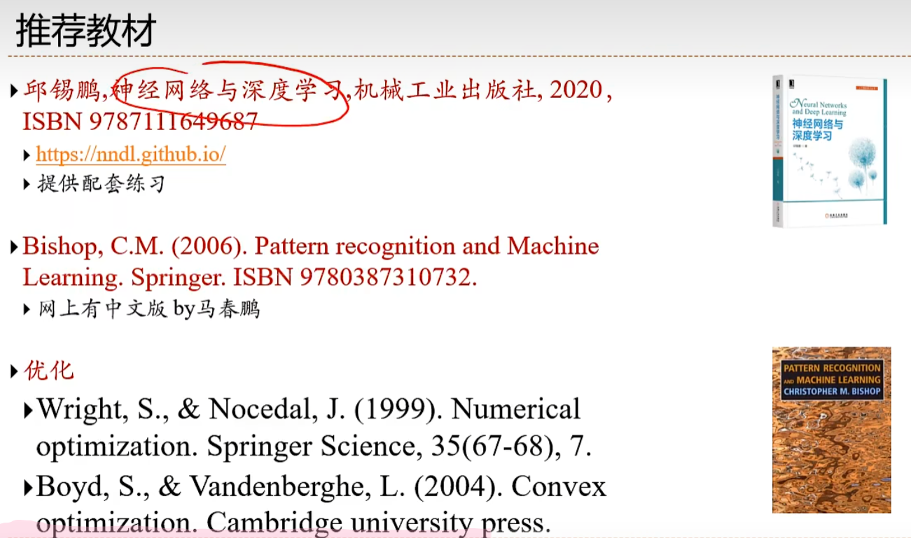

#### 顶会论文

- NeurIPS、ICLR、ICML、AAAI、IJCAI
- ACL、EMNLP
- CVPR、ICCV

#### 深度学习框架

简易和快速的原型设计
自动梯度设计
无缝CPU和GPU切换
分布式计算

- Pytorch
- theano（先驱）
- TensorFlow
- PaddlePaddle
- MindSpore
- Keras

#### 图灵测试

> “一个人在不接触对方的情况下，通过一种特殊的方式，和对方进行一系列的问答。如果在相当长时间内，他无法根据这些问题判断对方是人还是计算机，那么就可以认为这个计算机是智能的”。
>                           ---Alan Turing [1950]《Computing Machinery and Intelligence》

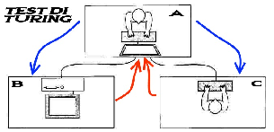

## **1.1 人工智能**

**人工智能**就是让机器具有人类的智能。
“计算机控制”+“智能行为”

> 人工智能就是要让机器的行为看起来就像是人所表现出的智能行为一样。
> 		John McCarthy

#### 三大流派

###### 连接主义

###### 符号主义

###### 行为主义

#### 人工智能的研究领域

###### 机器感知（计算机视觉、语音信息处理、模式识别）

###### 学习（机器学习、强化学习）

###### 语言（自然语言处理）

###### 记忆（知识表示）

###### 决策（规划、数据挖掘）

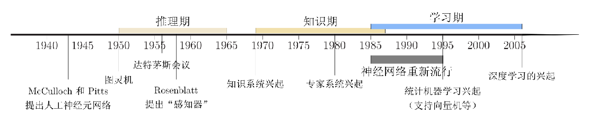

WordNet 

## 1.2 如何开发一个人工智能系统？

**专家知识（人工规则）**：简单规则
**机器学习**

#### 机器学习

机器学习约=构建一个映射函数（规则）

##### 芒果机器学习

How to explain Machine Learning Using Mangos
Ref [http://qr.ae/TUNAQD](https://link.zhihu.com/?target=http%3A//qr.ae/TUNAQD)

###### 准备数据

从市场上随机选取的芒果样本（训练数据），列出每个芒果的所有特征：
如颜色，大小，形状，产地，口碑，价格。。。
以及芒果质量（输出变量）：
甜蜜

###### 学习

设计一个学习算法来学习芒果的特征与输出变量之间的相关性模型。

**(x1,x2,...,x0,y)**
**f(x)=y**

###### 测试

下次从市场上买芒果时，可以根据芒果（测试数据）的特征，使用前面计算的模型来预测芒果的质量。

So 如何开发一个人工智能系统？

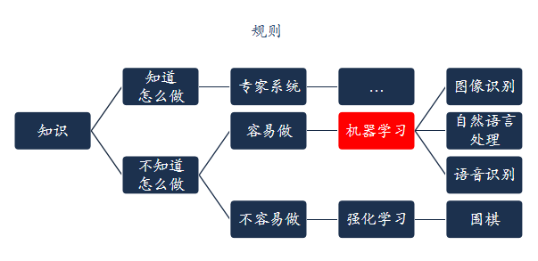

## 1.3 表示学习

机器学习来解决模式识别任务时的流程：
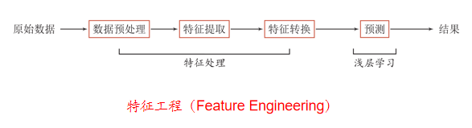

浅层学习(Shallow Learning):不涉及特征学习，其特征主要靠人工经验或特征转换方法来抽取。

**语义鸿沟**：底层特征 VS 高层语义

> 人们对文本、图像的理解无法从字符串或者图像的底层特征直接获得。

**好的表示**：主观概念，没有明确标准

> 但一般而言，一个好的表示具有以下优点：
> 具有很强的表示能力；
> 使后续的学习任务变得简单；
> 具有一般性，是任务或领域独立的。

**数据表示**是机器学习的核心问题。

###### 表示形式

- 局部表示：离散表示、符号表示，One-Hot（独热码）向量

- 分布式表示：压缩、低维、稠密向量
  用O(N)个参数表示O(2^k^)区间
   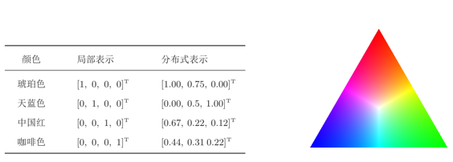

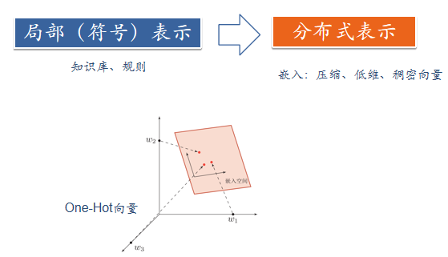

嵌入：Embeddings
词嵌入（Word Embeddings）

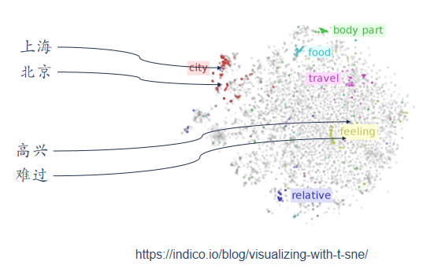

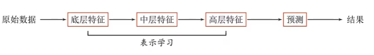

###### 表示学习：

自动从数据中学习好的表示

传统的特征提取 VS 表示学习

###### 特征提取

线性投影 PCA、LDA（线性判断降维算法）
非线性嵌入 LLE、Isomap、谱方法
自编码器

特征提取：基于任务或先验时对去除无用特征（多为分类器）
表示学习：用过深度学习高层语义特征 （难点：没有明确的目标）

## 1.4 深度学习

表示学习与深度学习：一个好的表示学习策略必须具备一定的深度

- **特征重用**：指数级的表示能力
- **抽象表示与不变性**：抽象表示需要多步的构造

###### 深度学习（DeepLearning）= 表示学习+决策（预测）学习

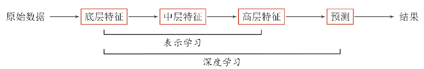

> 通过构建具有一定“深度”的模型，可以让模型来自动学习好的特征表示（从底层特征，到中层特征，再到高层特征），从而最终提升预测或识别的准确性。

难点：贡献度分配问题（各模块对最后结果影响比重及优化）
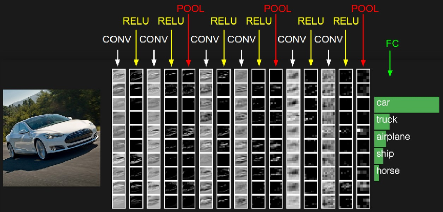

End-to-End:端到端学习

#### 深度学习的数学描述

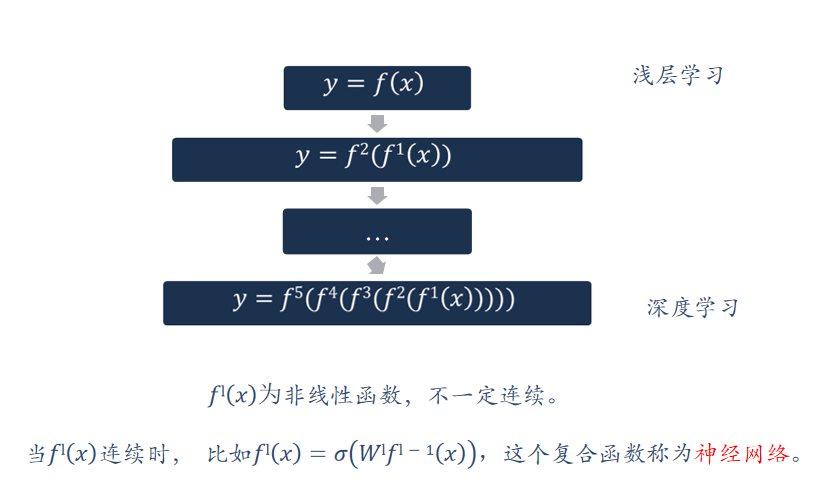

## 1.5 人脑神经网络

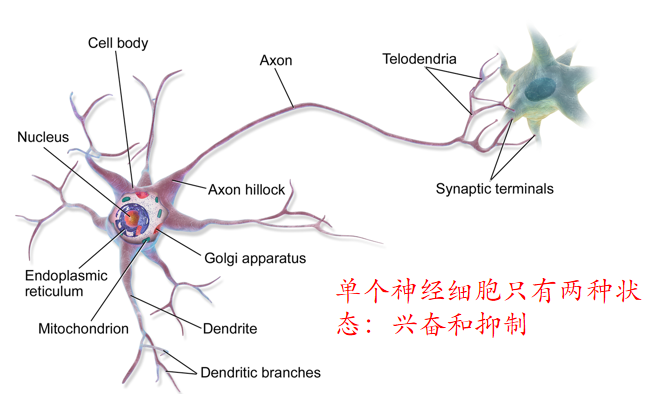

> **赫布法则 Hebb's Rule**
> “当神经元 A的一个轴突和神经元B很近，足以对它产生影响，并且持续地、重复地参与了对神经元B的兴奋，那么在这两个神经元或其中之一会发生某种生长过程或新陈代谢变化，以致于神经元A作为能使神经元B兴奋的细胞之一，它的效能加强了。”
> ----加拿大心理学家Donald Hebb，《行为的组织》，1949

> 人脑有两种记忆：长期记忆和短期记忆。短期记忆持续时间不超过一分钟。如果一个经验重复足够的次数，此经验就可储存在长期记忆中。短期记忆转化为长期记忆的过程就称为凝固作用。人脑中的海马区为大脑结构凝固作用的核心区域。

## 1.6 人工神经网络

###### 人工神经元

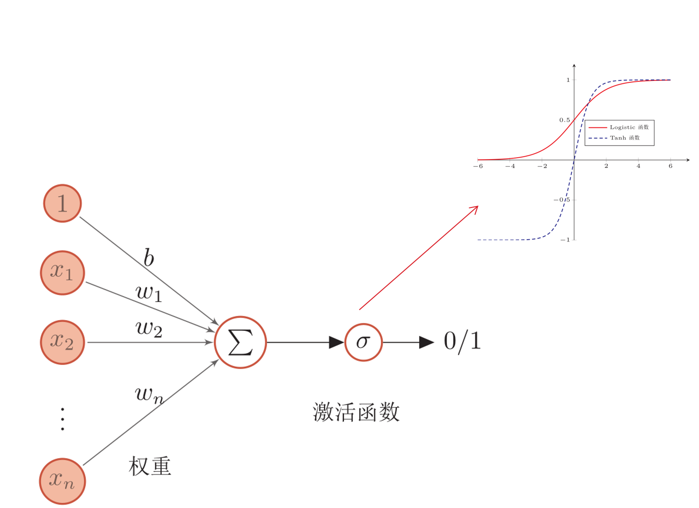

###### 人工神经网络

人工神经网络主要有大量的神经元以及他们之间的有向连接构成。主要考虑一下三个方面：

1. 神经元的激活规则
   主要是指神经元输入到输出之间的映射关系，一般为非线性函数
2. 网络的拓扑结构
   不同神经元之间的连接关系
3. 学习算法
   通过训练数据来学习神经网络的参数

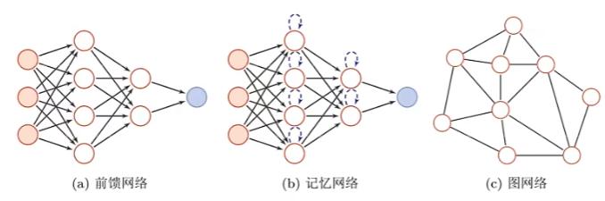

实际上大多数网络都为复合型结构，即一个神经网络中包括多种网络结构。

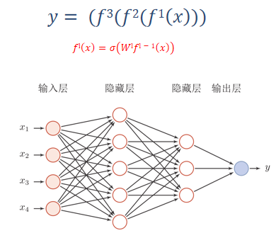

#### 如何解决贡献度分配问题

- 偏导数：

  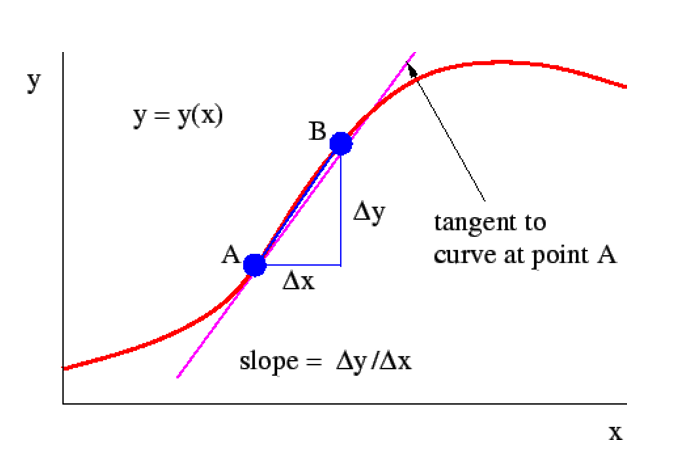

- 贡献度
  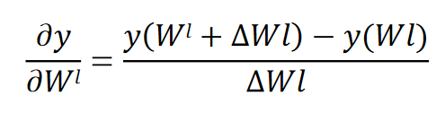

> 神经网络天然不是深度学习，但深度学习天然是神经网络。

## 1.7 神经网络发展史

神经网络的发展大致经过五个阶段。

#### 第一阶段：模型提出

> 在1943年，心理学家Warren McCulloch和数学家Walter Pitts和最早描述了一种理想化的人工神经网络，并构建了一种基于简单逻辑运算的计算机制。他们提出的神经网络模型称为**MP模型**。
>
> 阿兰·图灵在1948年的论文中描述了一种“**B型图灵机**”。**(赫布型学习)**
>
> 1951年，McCulloch和Pitts的学生Marvin Minsky建造了第一台神经网络机，称为SNARC。
>
> Rosenblatt [1958]最早提出可以模拟人类感知能力的神经网络模型，并称之为**感知器（Perceptron）**，并提出了一种接近于人类学习过程（迭代、试错）的学习算法。

#### 第二阶段：冰河期

> 1969年，Marvin Minsky出版《感知器》一书，书中论断直接将神经网络打入冷宫，导致神经网络十多年的“冰河期”。
> 他们发现了神经网络的两个关键问题：
> 1）基本感知器无法处理异或回路。（~感知器作为线性模型无法处理非线性问题~）
> 2）电脑没有足够的能力来处理大型神经网络所需要的很长的计算时间。
>
> 1974年，哈佛大学的Paul Webos发明**反向传播算法**，但当时未受到应有的重视。
>
> 1980年，Kunihiko Fukushima（福岛邦彦）提出了一种带卷积和子采样操作的多层神经网络：新知机（Neocognitron）（~卷积神经网络的先驱~）

#### 第三阶段：反向传播算法引起的复兴

> 1983年，物理学家John Hopfield对神经网络引入能量函数的概念，并提出了用于联想记忆和优化计算的网络（称为**Hopfield网络**），在旅行商问题上获得当时最好结果，引起轰动。
>
> 1984年，Geoffrey Hinton提出一种随机化版本的Hopfield网络，即**玻尔兹曼机**。
>
> 1986年， David Rumelhart和James McClelland对于联结主义在计算机模拟神经活动中的应用提供了全面的论述，并重新发明了**反向传播算法**。
>
> 1986年，Geoffrey Hinton等人将引入反向传播算法到多层感知器。
>
> 1989 年，LeCun等人将反向传播算法引入了卷积神经网络，并在手写体数字识别上取得了很大的成功。

#### 第四阶段：流行度降低

> 在20世纪90年代中期，统计学习理论和以支持向量机为代表的机器学习模型开始兴起。
> 相比之下，神经网络的理论基础不清晰、优化困难、可解释性差等缺点更加凸显，神经网络的研究又一次陷入低潮。

#### 第五阶段：深度学习的崛起

> 2006年，Hinton等人发现多层前馈神经网络可以先通过逐层预训练，再用反向传播算法进行精调的方式进行有效学习。
> 深度神经网络在语音识别和图像分类等任务上的巨大成功。
>
> 2013年，**AlexNet：第一个现代深度卷积网络模型**，是深度学习技术在图像分类上取得真正突破的开端。
> AlexNet不用预训练和逐层训练，首次使用了很多现代深度网络的技术。
>
> 随着大规模并行计算以及GPU设备的普及，计算机的计算能力得以大幅提高。此外，可供机器学习的数据规模也越来越大。在计算能力和数据规模的支持下，计算机已经可以训练大规模的人工神经网络。

