# 2. 机器学习概述

## 2.1 关于概率的一些基本概念

**概率 Probability**：一个随机时间发生的可能性大小，为0到1之间的实数
**随机变量 Random Variable**：比如随机掷骰子，得到的点数就可以看成一个随机变量X，其取值为{1,2,3,4,5,6}
**概率分布Probability Distribution**：一个随机变量X取每种可能值的概率
P并满足

#### 随机变量

###### 离散随机变量

- 伯努利分布(Bernoulli Distribution)
- 二项分布(Binomial Distribution)

###### 连续随机变量

概率分布一般使用**概率密度函数(Probability Density Function,PDF)**p(x)来描述

- 高斯分布(Gaussian Distribution)

**累积分布函数(Cumulative Distribution Function,CDF)**: 随机变量X的取值小于等于x的概率

#### 随机向量

一组随机变量构成的向量
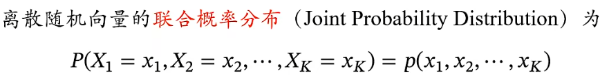

#### 条件概率

p(x,y)边缘概率：Marginal Probability

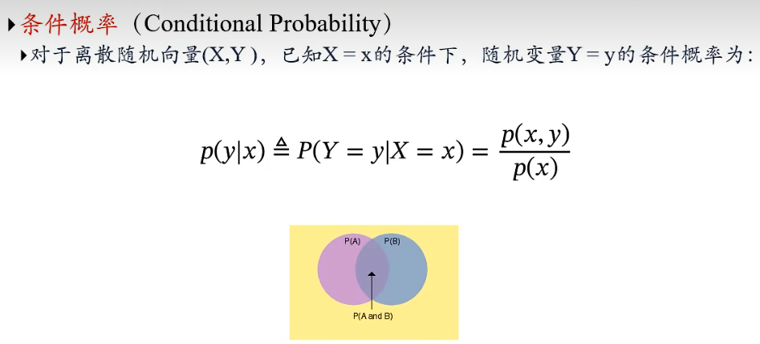

#### 采样(Sampling)

采样：给定一个概率分布p(x)，生成满足条件的样本，也叫抽样

##### 如何进行随机采样

- 直接采样（**伪随机**）
  - 均匀分布Uniform[0,1)
    x~t+1~ = (ax~t~+c)mod m (线性同余发生器)
    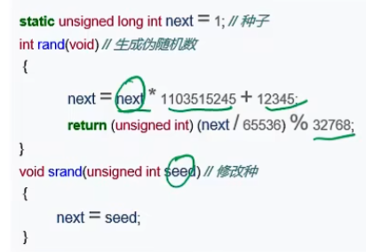
  - 均匀分布Uniform[a,b)
- 离散分布
- 其他连续分布
  - 逆变换采样(Inverse Transform Sampling)

#### 期望(Expectation)

期望：随机变量的均值
对于离散随机变量：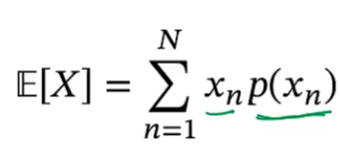
对于连续随机变量：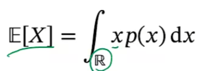

#### 大数定律(Law of Large Numbers)

## 2.2 机器学习定义

**机器学习约等于自动构造一个映射函数**

###### Q：为什么要“机器学习”Machine Learning，ML ？

A：现实世界的问题都比较复杂，很难通过规则来手工实现

###### Q：如何构建映射函数？

A：从大量数据中学习规律-function
X -> Y
represtation -> label
y = g(x)

#### 机器学习定义

机器学习：通过算法使得机器能从大量数据中学习规律从而对新的样本做决策。
机器学习输出是一个规律：决策（预测）函数
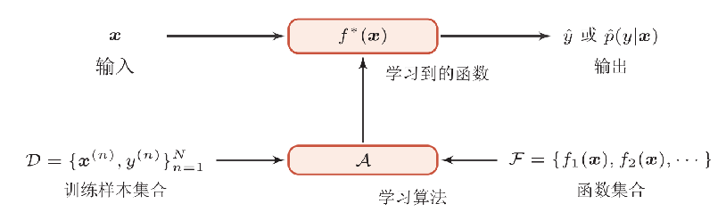

## 2.3 机器学习类型

###### **监督学习**

- **回归(Regression)问题**
  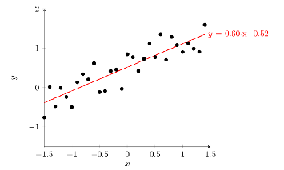
- **分类(Classification)问题**
  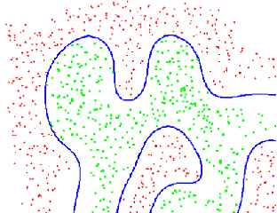

###### **无监督学习**

- **聚类(Clustering)问题**
  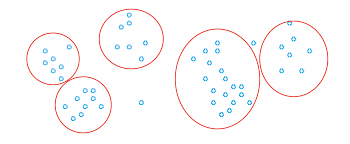无监督学习问题
- **降维问题**
- **密度估计问题**

###### **强化学习(Reinforcement Learning,RL)**

通过与环境进行交互来学习。
数据难以构建，通过决策结论，使得每步决策的预期收益最大化

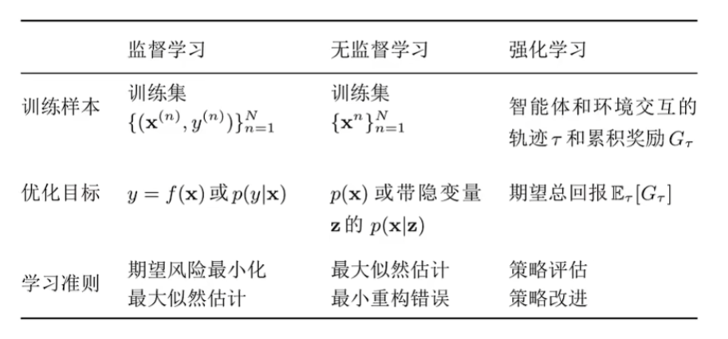

也可以按照其他方式分类

## 2.4 机器学习的要素

机器学习**四要素**：1. 数据 2. 模型 3. 学习准则 4. 优化算法
机器学习**三要素**：1. 模型 2. 学习准则 3. 优化算法

#### 模型

以回归(Regression)问题为例

- 线性模型
  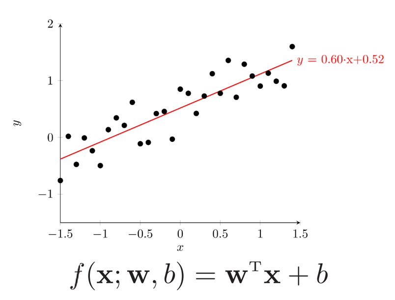
  
- 非线性模型
  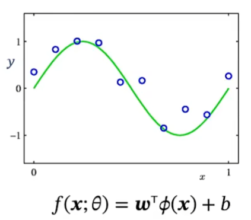
  
  如果 Φ(x) 是可学习的非线性基函数，f(x,θ) 就等价于神经网络

#### 学习准则

**一个好的模型应该在所有取值上都与真实映射函数一致**

###### **损失函数(Loss Function)**

损失函数是一个非负实数函数，用来量化模型预测和真实标签之间的差异
以回归问题为例：**平方损失函数（Squared Loss Function）** ：loss = ½(y_true - y_pred) ^2^

###### 期望风险(Expected Risk)

R(f) = E[L(y, f(x))] = ∫ L(y, f(x)) * P(x, y) dxdy
在所有可能的 x 和 y 上，损失函数 L(y, f(x)) 和概率分布 P(x, y) 的乘积的积分
机器学习的目标是通过优化算法来最小化这个期望风险。
期望风险只能通过大数定律使用**经验风险(Empirical Risk)**近似。(当N -> ∞，经验风险与期望风险无限接近)
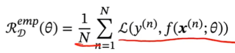

###### 经验风险最小化(Empirical Risk Mnimization, ERM)

寻找一个参数θ^*^,使得经验风险函数最小化。

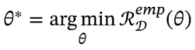

**风险函数确定后，机器学习问题转化为一个最优化问题。**

##### 最优化问题

凸优化和非凸优化问题的最优化问题

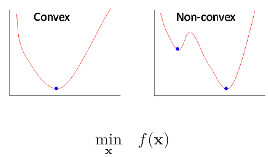

###### **梯度下降法(Gradient Descent)**

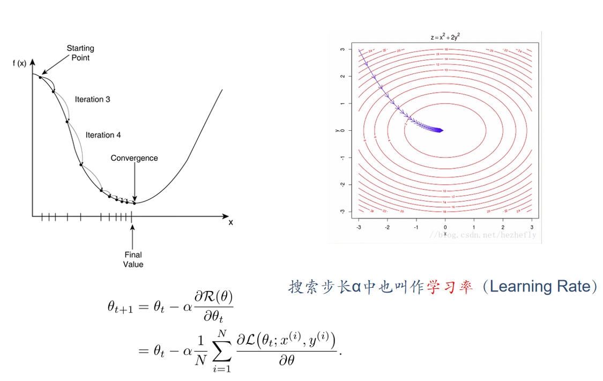
学习率是一个十分重要的**超参数**
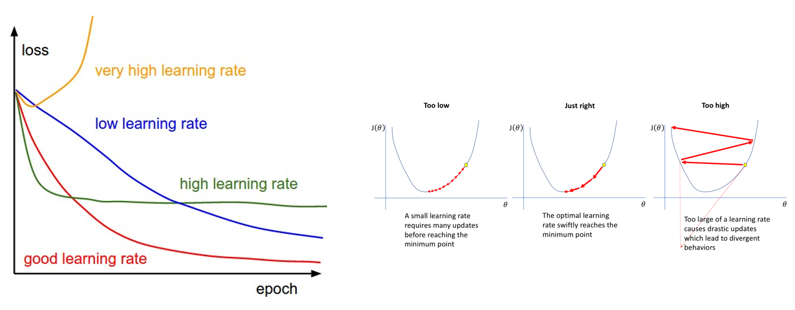
一个好的学习率：自适应学习率，动态变化的

###### **随机梯度下降法(Stochastic Gradient Descent,SGD)**

随机梯度下降法：在每次迭代时只采集一个样本。
当经过足够次数的迭代时，随机梯度下降也可以收敛到局部最优解
优点：每次计算开销小，支持在线学习
缺点：无法充分利用计算机的并行计算能力，
	   存在样本随机不到的情况，无法充分利用训练样本（解决方法，每次对训练集D中的样本随机排序）

###### **小批量(Mini-Batch)随机梯度下降法**

小批量梯度下降法
随机选取一小部分训练样本来计算梯度并更新参数
既可以兼顾随机梯度下降法的优点，也可以提高训练效率
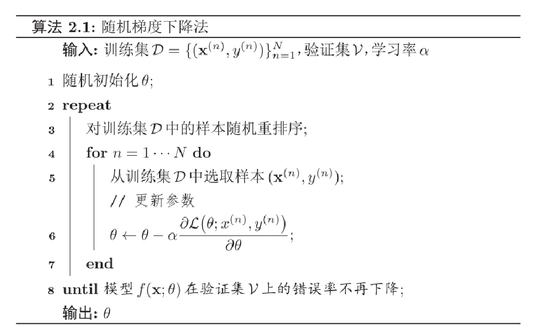

#### 优化算法

优化方法见2.5

## 2.5 泛化与正则化

前面提到机器学习转化为最优化问题，但机器学习不等于优化问题
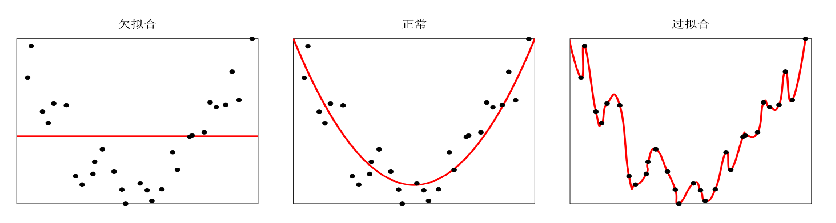

欠拟合：模型在训练集上错误率很高，训练不充分或者选用的模型效果有限。

过拟合：经验风险最小化原则很容易导致模型在训练集上错误率很低，但是在未知数据上错误率很高。
过拟合往往是由于训练数据少喝噪声等原因造成的。

#### 泛化误差

期望风险与经验风险之间的差异叫做泛化误差。

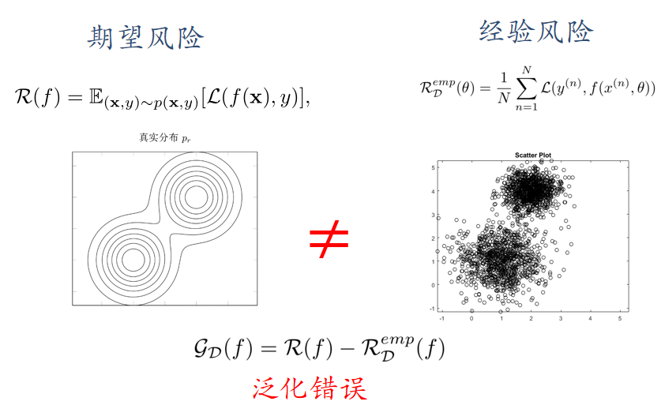

##### 如何减少泛化误差？

优化：经验风险最小(模型较复杂，导致容易过拟合)
正则化：降低模型复杂度

#### 正则化(Regularization)

所有损害优化的方法都是正则化

- 增加优化约束，如L1/L2约束、数据增强

  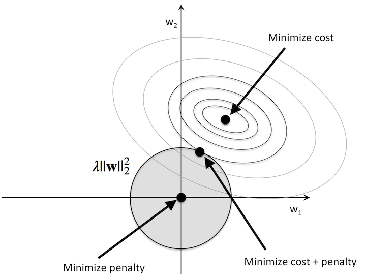

- 干扰优化过程，如权重衰减、随机梯度下降、提前停止
  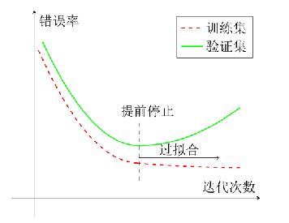

  ###### 提前停止

  提前停止：使用一个验证集(Validation Dataset) 来测试每一次迭代的参数再验证集上是否最优。

  如果再验证集上的错误率不再下降，就停止迭代。

  

## 2.6 线性回归

###### **回归(Regression)**

> 训练集：{x^(n)^,y^(n)^}^N^~n=1~
> 回归问题：
> x^(n)^∈R^D^
> y^(n)^∈R为连续变量
> **求解x,y之间的映射关系  y=f(x,θ)**

线性回归(Linear Regression)
模型 f(x;ω,b) = ω^T^x + b
ω: weight vector 权重向量
b: bios 偏置
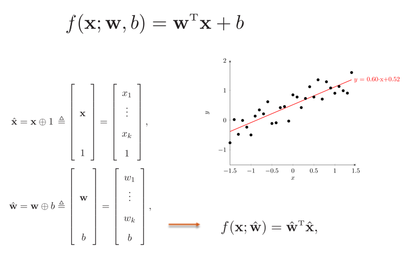

使用增广权重向量 x^^^ 和增广特征向量 ω^^^ 可写为更简洁的形式 f(x;ω,b) = ω^^^^T^x^^^

##### 矩阵微积分

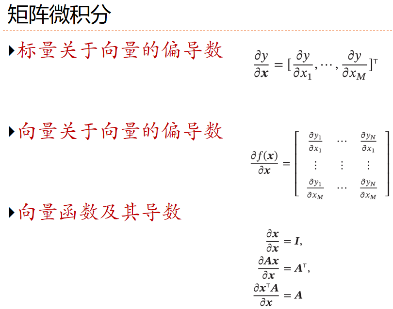

###### 经验风险最小化(Empirical Risk Minimization, ERM)

训练集D上的经验风险
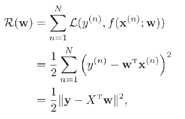
经验风险最小化
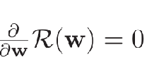
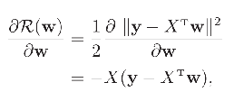

##### 最小二乘法(有问题，**略**)

######  结构结构最小化(Structure Risk Minimization, SRM)

- 当特征之间存在共线性时,当D>N，XX^T^不可逆(X∈ R^DxN^)

- 结构风险

  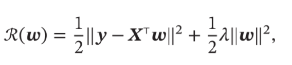

  令其最小化：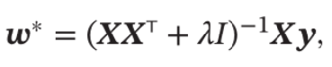

在统计方法上对应**岭回归(Ridge Regression)** 

## 2.7 多项式回归

##### 曲线拟合(Curve Fitting)

多项式曲线拟合的模型定义： 

​	f(x,ω) = ω~0~ +  ω~1~x +  ω~2~x^2^+ ... + ω~M~x^M^ =  ω^T^Φ(x) ，其中ω^T^ 为k^M+1^维度，

​	Φ(x)  = [[1] [x] [x^2^]...[x^M^]]

##### 损失函数

###### 平方误差 Sum-of - Squares

$$
(\omega) = \frac{1}{2}\sum_{n=1}^{N}(y^{(n)}- \omega^{T}\Phi (x^{n}) )^{2}
$$

###### 经验风险最小化

求解过程和线性回归类似

##### 如何选择选择多项式的次数(Degress)

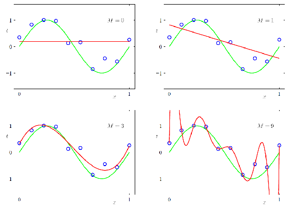

## 2.8 线性回归的概率视角

## 2.9 模型选择与 “偏差-方差” 分解

## 2.10 常用的定理