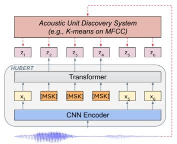

> 近日，腾讯游戏知几AI团队与西工大ASLP组联合发布了基于 WenetSpeech 1 万小时数据训练的中文版 Wav2vec 2.0 和 HuBERT 模型。
>
> Wav2vec 2.0 [1]，HuBERT [2] 和 WavLM [3] 等语音预训练模型，通过在多达上万小时的无标注语音数据（如 Libri-light ）上的自监督学习，显著提升了自动语音识别（Automatic Speech Recognition, ASR），语音合成（Text-to-speech, TTS）和语音转换（Voice Conversation，VC）等语音下游任务的性能。然而这些模型都没有公开的中文版本，不便于应用在中文语音研究场景。
>
> WenetSpeech [4] 是由西工大音频、语音和语言处理研究组 (ASLP@NPU)、出门问问、希尔贝壳联合发布的 1 万多小时多领域语音数据集。为了弥补中文语音预训练模型的空缺，我们开源了基于 WenetSpeech 1 万小时数据训练的中文版 Wav2vec 2.0 和 HuBERT 模型。
>
> 为了验证预训练模型的性能，我们在 ASR 任务进行了验证。实验结果表明，在 100 小时有监督数据 ASR 任务上，预训练模型学到的语音表征相对于传统声学 FBank 特征有显著的性能提升，甚至仅用 100 小时有监督数据能够得到和 1000 小时有监督数据可比的结果。
>
> 模型链接：https://github.com/TencentGameMate/chinese_speech_pretrain
>
> HuBERT 模型
>
> 
>
> 图 2: HuBERT 模型结构 (Hsu et al., 2021)
>
> HuBERT [2] 是 Meta 在 2021 年发表的模型，模型结构类似 Wav2vec 2.0，不同的是训练方法。Wav2vec 2.0 是在训练时将语音特征离散化作为自监督目标，而 HuBERT 则通过在 MFCC 特征或 HuBERT 特征上做 K-means 聚类，得到训练目标。HuBERT 模型采用迭代训练的方式，BASE 模型第一次迭代在 MFCC 特征上做聚类，第二次迭代在第一次迭代得到的 HuBERT 模型的中间层特征上做聚类，LARGE 和 XLARGE 模型则用 BASE 模型的第二次迭代模型提取特征做聚类。从原始论文实验结果来看，HuBERT 模型效果要优于 Wav2vec 2.0，特别是下游任务有监督训练数据极少的情况，如 1 小时、10 分钟。