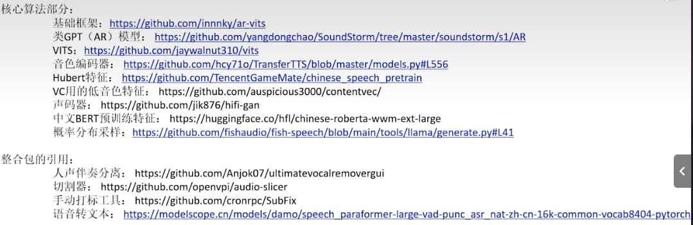

- HuBERT: Self-Supervised Speech Representation Learning by Masked Prediction of Hidden Units
  Hsu W N, Bolte B, Tsai Y H H, et al. Hubert: Self-supervised speech representation learning by masked prediction of hidden units[J]. IEEE/ACM Transactions on Audio, Speech, and Language Processing, 2021, 29: 3451-3460.

- Wang C, Chen S, Wu Y, et al. Neural codec language models are zero-shot text to speech synthesizers[J]. arXiv preprint arXiv:2301.02111, 2023.

> [1]Alexei Baevski, Henry Zhou, Abdelrahman Mohamed, and Michael Auli, “Wav2vec 2.0: A framework for self-supervised learning of speech representations,” in Proc. NeurIPS, 2020.
>
> [2]Wei-Ning Hsu, Benjamin Bolte, Yao-Hung Hubert Tsai, Kushal Lakhotia, Ruslan Salakhutdinov, and Abdelrahman Mohamed, "HuBERT: Self-supervised speech representation learning by masked prediction of hidden units," IEEE/ACM Transactions of Audio, Speech, and Language Processing, vol. 29, pp. 3451-3460, 2021
>
> [3]Sanyuan Chen, Chengyi Wang, Zhengyang Chen, Yu Wu, Shujie Liu, Zhuo Chen, Jinyu Li, Naoyuki Kanda, Takuya Yoshioka, Xiong Xiao, Jian Wu, Long Zhou, Shuo Ren, Yanmin Qian, Yao Qian, Jian Wu, Michael Zeng, Xiangzhan Yu, and Furu Wei, “WavLM: Large-scale self-supervised pre-training for full stack speech processing,” arXiv preprint arXiv:2110.13900, 2021
>
> [4]Binbin Zhang, Hang Lv, Pengcheng Guo, Qijie Shao, Chao Yang, Lei Xie, Xin Xu, Hui Bu, Xiaoyu Chen, Chenhen Zeng, Di Wu, and Zhendong Peng, "WenetSpeech: A 10000+ hours multi-domain Mandarin corpus for speech recognition," in Proc. ICASSP, 2021
>
> [5]Ashish Vaswani, Noam Shazeer, Niki Parmar, Jakob Uszkoreit, Llion Jones, Aidan N. Gomez, Lukasz Kaiser and Illia Polosukhin, "Attention is all you need," in Proc. NeurIPS, 2017
>
> [6]Myle Ott, Sergey Edunov, Alexei Baevski, Angela Fan, Sam Gross, Nathan Ng, David Grangier, and Michael Auli, “fairseq: A fast, extensible toolkit for sequence modeling,” in Proc. NAACL, 2019.
>
> [7]Shinji Watanabe, Takaaki Hori, Shigeki Karita, Tomoki Hayashi, Jiro Nishitoba, Yuya Unno, Nelson Enrique Yalta Soplin, Jahn Heymann, Matthew Wiesner, Nanxin Chen, Adithya Renduchintala, and Tsubasa Ochiai, “ESPnet: End-to-end speech processing toolkit,” in Proc. Interspeech, 2018, pp. 2207–2211
>
> [8]Pengcheng Guo, Florian Boyer, Xuankai Chang, Tomoki Hayashi, Yosuke Higuchi, Hirofumi Inaguma, Naoyuki Kamo, Chenda Li, Daniel Garcia-Romero, Jiatong Shi, Jing Shi, Shinji Watanabe, Kun Wei, Wangyou Zhang and Yuekai Zhang, "Recent development on ESPnet tookit boosted by Conformer," in Proc. ICASSP, 2021
>
> [9]Xuankai Chang, Takashi Maekaku, Pengcheng Guo, Jing Shi, Yen-Ju Lu, Aswin Shanmugam Subramanian, Tianzi Wang, Shu-wen Yang, Yu Tsao, Hung-yi Lee, and Shinji Watanabe, "An exploratino of self-supervised pretrained representations for end-to-end speech recognition," in Proc. ASRU, 2021
>
> [10]Anmol Gulati, James Qin, Chung-Cheng Chiu, Niki Parmar, Yu Zhang, Jiahui Yu, Wei Han, Shibo Wang, Zhengdong Zhang, Yonghui Wu, and Ruoming Pan, “Conformer: Convolution-augmented Transformer for speech recognition,” in Proc. Interspeech, 2020, pp.5036–5040© THE END
