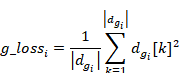

（一）KL散度损失

KL散度损失（Kullback-Leibler Divergence），也称为相对熵，是一种用于衡量两个概率分布之间差异的非对称度量。它在信息论和机器学习中具有广泛的应用，特别是在概率模型的比较和优化中。`loss_kl` 代表的是KL散度损失，用于衡量两个概率分布之间的差异。计算KL散度损失并乘以一个超参数以调整其权重。KL散度的公式如式（3-4）：

|  | （3-4） |
| ------------------------------------------------- | ------- |
|                                                   |         |

式（3-4）中： 和 是近似分布Q的均值和标准差， 和 是近似分P的均值和标准差。

在实际的使用中：

loss_kl = kl_loss(z_p, logs_q, m_p, logs_p, z_mask) * hps.train.c_kl

`kl_loss` 是计算KL散度的函数，z_p：目标分布的潜变量。

logs_q：近似分布的对数方差（对数方差通常用于稳定数值计算）。

m_p：目标分布的均值。

logs_p：目标分布的对数方差。

z_mask：遮罩，用于选择参与计算的潜变量。

该函数返回的KL散度值再乘以超参数 `hps.train.c_kl`，以调整KL散度损失在整体损失函数中的权重。

（二）Mel频谱的L1损失

Mel频谱常用于表征语音信号。Mel频谱的L1损失（也称为平均绝对误差，MAE）是衡量生成的Mel频谱与目标Mel频谱之间差异的一种常见方法。L1损失的公式如下：

给定目标Mel频谱𝑀target和生成的Mel频谱𝑀pred，它们的L1损失定义如式（3-5）：

|      |  | （3-5） |
| ---- | ------------------------------------------------- | ------- |
|      |                                                   |         |

式（3-3）中：是频谱的频率， 表示第帧的目标Mel频谱， 表示第帧的生成Mel频谱，表示L1范数，即绝对值。

（三）特征匹配损失

特征匹配损失用于衡量两个特征图（真实音频和生成音频的Mel频谱）之间的差异。选择直接计算了两个Mel频谱特征图（真实和生成）之间的绝对差的均值，并将结果累加起来作为特征匹配损失，用于生成模型中常用来提高生成结果的质量。

（四）判别器损失

自定义的判别器损失如下：

定义Dr={dr1,dr2,…,drN}为判别器对真实数据的输出列表，

定义Dg={dg1,dg2,…,dgN}为判别器对生成数据的输出列表，

定义r_lossi为第i个真实数据的损失，对每个判别器输出如式（3-6）：

|  | （3-6） |
| ------------------------------------------------- | ------- |
|                                                   |         |

 

定义g_lossi为第i个真实数据的损失，如每个判别器输出gri如式（3-7）：

|  | （3-7） |
| ------------------------------------------------- | ------- |
|                                                   |         |

 

则判别器的总损失如式（3-8）

|  | （3-8） |
| ------------------------------------------------- | ------- |
|                                                   |         |

（五）判别器损失

自定义的判别器损失，遍历所有判别器输出，分别计算生成数据的损失，并将所有的损失累加起来得到最终的生成器损失：

定义Dg={dr1,dr2,…,drN}为判别器对真实数据的输出列表，

定义为第i个生成数据的损失，则对每个判别器输出的的损失如式（3-9）：

|  | （3-9） |
| -------------------------------- | ------- |
|                                  |         |

累加所有生成数据的生成器的总损失如式（3-10)：

|  | （3-10） |
| ------------------------------------------------- | -------- |
|                                                   |          |