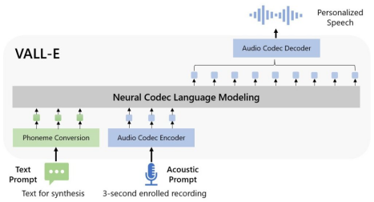

Unlike the previous pipeline (e.g., phoneme → mel-spectrogram → waveform), the pipeline of VALL-E is phoneme → discrete code → waveform. VALL-E generates the discrete audio codec codes based on phoneme and acoustic code prompts, corresponding to the target content and the speaker’s voice. VALL-E directly enables various speech synthesis applications, such as zero-shot TTS, speech editing, and content creation combined with other generative AI models like GPT.
与之前的流程（如音素→梅尔语图谱→波形）不同，VALL-E 的流程是音素→离散编码→波形。VALL-E 根据音素和声码提示生成离散音频编解码代码，与目标内容和说话者的声音相对应。VALL-E 可直接实现各种语音合成应用，如零点 TTS、语音编辑，以及与其他生成式人工智能模型（如 GPT）相结合的内容创建。

在自然语言处理（NLP）中，`top_k`、`top_p` 和 `temperature` 是生成文本时常用的参数，它们通常用于控制文本生成的多样性和质量。

1. ## **Top-k sampling**：

   - `top_k` 参数定义了在生成词汇时，模型从概率最高的前 k 个词中进行选择。它会剔除掉所有概率低于前 k 个词的词汇，从而保持了一定的多样性。这样做可以防止模型产生过于确定性的输出。
   - 较小的 `top_k` 值通常会导致生成的文本更加多样化，但也可能会降低生成文本的连贯性和合理性。

2. **Nucleus (Top-p) sampling**：

   - `top_p`（也称为 nucleus sampling 或 top-p sampling）则定义了一个概率阈值，模型会在累积概率超过该阈值时停止采样。换句话说，模型会保留累积概率高于 `top_p` 的词汇，但剔除掉概率低于该阈值的词汇。这也是一种保持多样性的采样策略。
   - 与 `top_k` 不同，`top_p` 不是剔除词汇，而是剔除它们的概率质量，因此在某种程度上保留了更多的选择余地。

3. **Temperature**：

   - `temperature` 参数控制了模型生成的多样性。它通过缩放模型生成的概率分布来影响生成过程中的熵。较高的 `temperature` 会增加输出的多样性，但也可能导致输出更不确定和无结构。较低的 `temperature` 会增加输出的确定性，使其更接近于模型预测的概率分布。
   - 常见的范围是从 0.1 到 2.0 之间。较高的 `temperature` 通常会产生更多的错误和无效文本，而较低的 `temperature` 则可能会产生过于单调和重复的文本。

在使用这些参数时，需要根据具体的应用场景和生成任务进行调整，以获得合适的文本生成效果。
