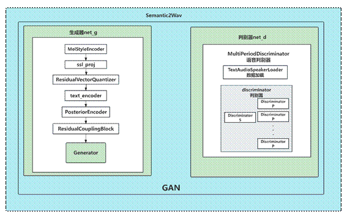
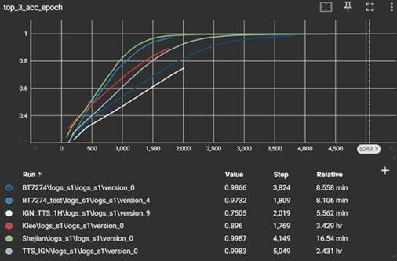
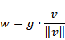

 

 

 

****

**本科毕业设计（论文）**

 

 

 

| 题  目： | 语音合成的研究与实现 |         |           |
| -------- | -------------------- | ------- | --------- |
| 姓  名   | 刘光硕               | 学   号 | 204010218 |
| 专  业   | 智能科学与技术       | 班   级 | 2020级1班 |
| 合作人   | 无                   | 学   号 | 无        |
| 指导老师 | 姜丹                 | 日   期 | 2024年6月 |

 

 

**
**

摘  要

本论文主要介绍了基于为GPT-SoVITS的文本转语音 (Text To Speech) 技术项目的模型训练、模型技术研究复现工作以及基于研究进行的模型优化和落地应用尝试的工作(具体包括一个便于服务器部署的TTS后端系统、一个面向个人用户的TTS web应用)。

GPT-SoVITS结合了GPT和SoVITS两种技术，其中GPT是一种基于Transformer的自然语言处理模型，具有很强的文本生成能力。SoVITS是一种基于深度学习的语音转换技术，可以将一个人的语音转换为另一个的音色，通过两种技术的结合，GPT-SoVITS 可以实现高度逼真的语音生成效果。GPT-SoVITS 最早提出是为了在语音音色克隆领域实现变声(Voice Conversion)功能中，弥补SoVITS模型所使用的语义特征编码器SoftVC 在去音色过程中导致token存在音色特征泄露导致变声效果不佳的问题，使用CN_Hubert(原始Hubert使用wenet中文数据训练的参数)作为音色特征，利用自回归结构的类GPT结构补全的token始终参考了历史token，因此也携带了参考音频的音色，起到了承担音色引导的功能，从了降低了VITS 重建目标音色的压力，提高了音色克隆的效果，再将GPT的Condition部分由ContentVec语义特征改为参考音频的文本输入，从而将GPT-SoVITS的功能从变声变更为文本合成语音(TTS,Text-To-Speech)。

毕设项目在使用GPT-SoVITS预训练模型基础上进行了不同角色音色的模型微调训练及模型优化测试工作，使用Gradio框架完成了训练数据批量处理和训练过程的WebUI可视化，并搭建了一个允许用户使用训练好的音色模型进行语音合成的WebAPP 落地应用，实现了快速优质的TTS语音合成音频效果。

关键词：TTS 文本转语音；语音合成；声音克隆

 

ABSTRACT

This paper primarily presents work on model training, technical investigation, optimization, and application attempts of a prevalent text-to-speech (TTS) technology project known as GPT-SoVITS. The efforts include the development of a TTS backend system suitable for server deployment and a TTS web application tailored for individual users.

GPT-SoVITS amalgamates two technologies: GPT, based on Transformer, a natural language processing model renowned for its robust text generation capabilities, and SoVITS, a deep learning-based speech conversion technology adept at transforming one person's speech into another's. By combining these two technologies, GPT-SoVITS achieves highly realistic speech synthesis.

Initially conceived for voice conversion in the field of speech timbre cloning, GPT-SoVITS addresses the issue of inadequate voice conversion effects caused by token voice feature leakage during the de-timbre process of the SoVITS model, utilizing CN_Hubert (Hubert originally trained with Chinese data in Wenet) as the voice feature. Employing a self-regressive structure akin to GPT, wherein completed tokens consistently reference historical tokens, ensures the tokens carry reference voice characteristics, thereby serving the function of voice guidance. This approach reduces the pressure on VITS to reconstruct the target voice and enhances voice cloning effectiveness. Furthermore, the functionality of GPT-SoVITS is shifted from voice conversion to text synthesis-to-speech (TTS) by replacing GPT's Condition section with text input, thereby altering the function of GPT-SoVITS from voice conversion to text-to-speech synthesis.

 

Key words: Text-To-Speech (TTS), Speech Synthesis, Voice Cloning.

目  录

[摘   要........................................................................................................................... I](#_Toc169037892)

[ABSTRACT..................................................................................................................... II](#_Toc169037893)

[目  录......................................................................................................................... III](#_Toc169037894)

[1 绪论............................................................................................................................... 1](#_Toc169037895)

[1.1 课题背景和意义........................................................................................................ 1](#_Toc169037896)

[1.2 国内外最新研究........................................................................................................ 1](#_Toc169037897)

[1.3 本文研究内容............................................................................................................ 2](#_Toc169037898)

[2 相关技术综述............................................................................................................... 3](#_Toc169037899)

[2.1 语音合成综述............................................................................................................ 3](#_Toc169037900)

[2.2 语音识别综述............................................................................................................ 4](#_Toc169037901)

[2.3 中文语音合成研究.................................................................................................... 5](#_Toc169037902)

[2.4 文本信息的特征提取综述........................................................................................ 5](#_Toc169037903)

[3 基于GPT-SoVITS模型研究及工作介绍................................................................... 8](#_Toc169037904)

[3.1 相关模型.................................................................................................................... 8](#_Toc169037905)

[3.2 GPT-SoVITS模型原理及实现详解........................................................................ 10](#_Toc169037906)

[3.3 训练数据处理.......................................................................................................... 11](#_Toc169037907)

[3.4 模型训练.................................................................................................................. 25](#_Toc169037908)

[3.5 实验与分析.............................................................................................................. 29](#_Toc169037909)

[4 语音合成系统............................................................................................................. 33](#_Toc169037910)

[4.1 模型推理说明.......................................................................................................... 33](#_Toc169037911)

[4.2 用户TTS Web 程序............................................................................................... 33](#_Toc169037912)

[5 总结与展望................................................................................................................. 36](#_Toc169037913)

[5.1 工作总结.................................................................................................................. 36](#_Toc169037914)

[5.2 工作展望.................................................................................................................. 36](#_Toc169037915)

[致 谢............................................................................................................................. 38](#_Toc169037916)

[参考文献......................................................................................................................... 39](#_Toc169037917)

[附录1 参考借用的代码和项目库................................................................................ 41](#_Toc169037918)

[1.1 GPT-SoVITS核心框架:........................................................................................... 41](#_Toc169037919)

[1.2 音频数据处理工具类.............................................................................................. 41](#_Toc169037920)

[1.3 使用的开源预训练模型数据及来源地址：.......................................................... 42](#_Toc169037921)

[附录2 类SoVITS模型语音合成模型类说明............................................................. 43](#_Toc169037922)

[2.1 SynthesizerTrn.......................................................................................................... 43](#_Toc169037923)

[2.2 MultiPeriodDiscriminator......................................................................................... 46](#_Toc169037924)

[诚信声明......................................................................................................................... 49](#_Toc169037925)

# 1 绪论

1.1课题背景和意义

TTS（文本转语音）技术的发展不仅是技术进步的表现，更是对语音交互领域产生重大影响的关键因素。这项技术不仅让人机交互变得更加自然和方便，还在多个领域发挥着重要作用。

TTS技术可以为学生提供个性化的学习体验。通过把教材内容转化为语音，学生可以通过听的方式更好地理解和记住知识点，从而提升学习效果。在语言教学方面，TTS可以把文字内容转成语音，让学生更直观地感受到语言的发音和语调，提高语言学习的效果。这对远程教育和语言培训等领域都有很大的帮助。

TTS技术为娱乐视频的配音提供了高效灵活的解决方案。制作人可以用TTS生成自然流畅的语音，为视频中的文字内容增添生动的音频表现力，节省专业配音的成本和时间。在虚拟形象、动画、游戏等领域，TTS技术可以赋予虚拟角色真实的语音。这不仅丰富了虚拟形象的表现力，还为游戏和动画制作提供了更多创作可能性。在娱乐视频中，使用TTS技术可以改善用户的观看体验。自然且富有表现力的语音能够吸引观众的注意力，使内容更生动、更吸引人，提高体验者的代入感，为数字感听艺术的发展提供了有力支持，推动了艺术形式的发展。

除此之外，由于小语种和方言的语音录制成本较高，很多语音保护工作展开困难，成本较大，而TTS技术通过模型训练，能够生成自然、准确的小语种和方言语音，有助于保护这些语言的文化遗产。特别是对于一些濒临失传的方言，语音合成可以帮助记录、保存，并在需要的时候重新呈现，有助于保护多样化的语言文化遗产。

如今基于深度学习及引入Transformer架构的端对端TTS技术应用越来越广泛，作为人机交互的重要手段已经渗透到国家发展的各行各业中，这一技术对于夺取我国现代化新胜利，谱写人民美好生活新篇章，实现中华民族的伟大复兴，具有重大而深远的意义。因此，开展关于TTS语音合成的课题有助于我国科技产业及文化产业的发展，使我国在深度学习领域处于国际领先地位。

1.2国内外最新研究

2021年由KAKAO与KAIST韩国科学院所提出的VITS[1]模型框架，使用normalizing flow和对抗训练方法，结合VAE-FLOW的前沿架构（使用变分自编码器（Variational Autoencoder，VAE）和正则化流（Normalizing Flows）相结合的体系结构），通过引入一个随机持续时间预测器，解决了TTS系统的一对多问题（给定相同的文本输入，系统可以生成具有不同语音节奏和持续时间的多个变化），取得了逼近真实的语音效果。后续微软亚洲科学院谭旭主导的Neural TTS正是借鉴VITS模型并采用了Diffusion模型并在大数量音频数据上进行训练，在情绪控制方面取得了良好的效果，被广泛应用于语音助手、新闻阅读、有声读物创作等场景。

2023年年初微软提出的VALL-E[2]通过语言模型的方式实现语言合成，被誉为语音合成大模型的开山之作，其核心思想就在于将语音数据使用离散的中间特征进行表示，然后使用语言模型的思路建模这些离散的中间表征的上下文表示并使用自注意力转换器（Transformer）[3]及自回归的训练方式，使得大参数深度学习模型能够学习到文本与语音之间的复杂映射关系，从而实现从文本到语音的转换。在实现3s参考音频的零样本文本到语音合成(Zero-shot Text-to-Speech, Zero-shot TTS，指的是无需fine-tuning模型训练参数，仅通过提供prompt text 和 audio 实现声音克隆)领域实现了出色效果。

2023年下半年，部分国内的开发者将NLP领域中取得良好效果的预训练语言表征模型如Bert[4] ( Bidirectional Encoder Representation from Transformers，是一个预训练的语言表征模型)引入到对VITS模型文本信息的辅助特征提取任务，所构建的Bert-VITS项目基本解决了VITS模型的语调问题，且借助预训练技术使得即使相对较少的数据量及算力资源就能取得堪称惊艳的生成效果。

1.3本文研究内容

本文主要研究一种名为GPT-SoVITS的融合了类GPT（Generative Pre-trained Transformer）训练的VITS变种TTS模型。GPT-SoVITS灵感来源于SoVITS(SoftVC VITS Singing Voice Conversion)模型项目，最早是为了音色克隆变声(Voice Conversion)领域实现小体量参考音频实现高质量的AI歌手效果，其借助保留了丰富音色信息的CN-Hubert(原始Hubert[5]使用wenet中文数据训练的参数)特征，并使用Hubert和RVQ将音频转换为包含音色的语义token，再利用类GPT [6]模型将token补全，由于类GPT模型的自回归特性，推理时后面的token始终会继承一些参考音频音色。在引入Hubert 分担一部分音色压力后，剩下的VITS的重建目标音色压力就会小，使得音色克隆具备了可能性，将GPT模型的condition变更为文本，使得GPT-SoVITS的功能从变声转换为TTS文本转语音生成任务，并能取得很好的效果。

 

# 2 相关技术综述

2.1语音合成综述

早期基于计算机的语音合成方法包括关节运动合成、共振峰合成和串联合成。随着统计机器学习的发展，提出了统计参数语音合成（SPSS），该方法预测合成语音所需的参数，如频谱、基频和持续时间。SPSS通过建模文本和声学参数之间的统计关系，实现了更自然和可懂的语音合成，首先生成语音所需的声学参数，然后使用某些算法从生成的声学参数中恢复语音。这个阶段的突破性模型包括基于隐马尔可夫模型（HMM）的系统。

从2010年代开始，基于神经网络的语音合成逐渐成为主流方法，大大提高了语音质量。

如WaveNet（2016年）[7]是由DeepMind提出的一种基于深度生成模型的语音合成技术，采用了深度卷积网络。它通过生成波形的方式，提高了合成语音的质量。

早期主要是基于神经网络的自回归的TTS，其最大缺点在于推理速度慢为克服该限制，提高合成速度，非自回归的方法也提出，如ClariNet、FastSpeech等。相比于先前的基于串联合成和统计参数合成的TTS系统，基于神经网络的语音合成具有更高的语音质量、更少的人工预处理和特征开发需求[8]。

图2-1 传统两段式TTS语音合成示意

如图2-1所示，传统的TTS系统一般要进行两个阶段的建模，即文本预测频谱，得到梅尔谱、特征谱，在进行滤波变换得到声音波形。两阶段训练的训练方案存在问题，不能生成高质量模型；第一阶段的频谱与实际频谱存在差异；两阶段模型各自独立训练，也导致其组合使用的效果也有着性能上的损失（主要是第一阶段文本生成频谱过程中生成的频谱与实际语音的频谱存在差异），语音生成的效果存在上限。

近年来，由于端对端及多模态大模型中对于隐参数的应用在NLP技术上的突破及验证，研究人员开始尝试进行端到端的语音合成系统，直接从文本生成语音波形，Tacotron[9]是第一个较为成熟的端到端的TTS模型，从Tacotron到Tacotron 2，致力于直接从文本生成对应的语音波形。Tacotron模型采用了序列到序列的架构，而Tacotron 2引入了注意力机制。这些模型为端到端的语音合成提供了有效的框架。

除此之外，随着Transformer[3]架构的成功应用于自然语言处理领域，它也被引入到TTS任务中。一些模型，如TransformerTTS[10]，Fastspeech2[11]，其中TransformerTTS将Tacotron2和Transformer结合来提高语音合成的效率和质量。而FastSpeech2是基于Transformer的端到端TTS模型，实现了mel-spectrogram的并行化生成，克服了传统的end-to-end TTS模型(如Tacotron2)由于使用了auto-regressive的架构所导致的生成语音的速度比较慢的问题。

2.2语音识别综述

自动语音识别（Automatic Speech Recognition，ASR）技术近年来取得了显著进展，逐渐成为人机交互领域的重要组成部分。ASR系统通过将人类语音信号转换为文字，使机器能够理解和处理口语指令，从而实现语音助手、实时翻译、自动字幕等多种应用。

ASR技术的发展经历了几个重要阶段。从早期基于模板匹配的方法，到隐马尔可夫模型（Hidden Markov Models，HMM）主导的时代，再到深度学习特别是卷积神经网络（Convolutional Neural Networks，CNN）和循环神经网络（Recurrent Neural Networks，RNN）的引入，ASR的准确性和鲁棒性得到了极大提升。近年来，基于端到端训练的模型（如深度神经网络DNN和长短期记忆网络LSTM）逐渐成为主流，使得语音识别系统能够在无需手工设计特征的情况下，直接从原始语音数据中学习。

在深度学习的推动下，ASR系统的性能不断提升。特别是Transformer架构的引入，[12]例如BERT和GPT，对ASR系统的性能提升起到了关键作用。这些模型通过更有效的自注意力机制，能够捕捉更长距离的依赖关系，改善语音识别的效果。此外，多任务学习和迁移学习等技术也被广泛应用，进一步提高了ASR系统在不同应用场景下的泛化能力。

ASR技术仍面临许多挑战。例如，背景噪音、口音差异、多语言处理等问题仍然困扰着研究者和工程师。为了应对这些挑战，研究人员不断探索新的方法，包括多模态融合、少样本学习和语音增强等技术。这些方法不仅有助于提高ASR系统的准确性，还能扩展其在更多复杂场景下的应用能力。

由于目前ASR技术意见相当成熟，语音合成的音频数据可以使用ASR进行对应语音文本内容的获取，可以用于生成语音合成（TTS）模型训练所需的文本数据。这种方法可以显著提高TTS模型的训练效率和质量。

2.3中文语音合成研究

中文语音合成的发展和现状在过去几年取得了显著的进展。随着深度学习和人工智能技术的发展，中文语音合成系统变得越来越自然、流畅，广泛应用于各种领域。

在发展初期，中文语音合成主要依赖规则和统计方法，这种方法在模拟语音发音上存在一定的局限性，生成的语音不够自然。随着深度学习技术的兴起，特别是端到端的深度学习模型的引入，中文语音合成取得了显著的突破[13]。

目前，中文语音合成基本采用基于深度学习的端到端模型，如Tacotron2系列。这些模型通过神经网络学习输入文本和输出语音之间的映射关系，实现了更加自然、富有表现力的语音生成[14]。

特别是去年大范围的VITS及其衍生模型的应用，使得生成的语音质量进一步提升，基本上解决了VITS的语气韵律问题，在效果非常出色的情况下训练的成本开销普通人也完全可以接受[15]。

而在行业应用方面，中文语音合成被广泛应用于智能语音助手、实时翻译、语音导航、智能客服、虚拟主持人等领域。随着语音合成技术的不断提升，用户与智能设备的交互变得更加自然和高效，为智能化生活和工作提供了便捷的解决方案。[16]语音合成技术尤其能够改善人机交互困难的情景，特别是对那些有身体障碍、只能通过语音来交流的特殊人群，使得人与计算机的交流更加方便快捷。

此外，中文语音合成在在线教育和培训领域也发挥着越来越重要的作用。通过语音合成技术，教育平台可以提供更生动、有趣的学习体验，促进学生的语言听力和口语能力的发展[17]。

然而，中文语音合成技术仍存在诸多不足。例如，中文语音合成的复杂性、语义混淆问题、个性化声线迁移以及方言口音适应性等方面仍需要进一步改进。这些问题的解决将有助于提高中文语音合成的质量和用户体验，使其在更多应用场景中发挥更大的作用。

2.4文本信息的特征提取综述

在TTS项目中，文本信息的特征提取是关键步骤之一。高质量的特征提取能够有效提升TTS模型的语音合成质量。这里重点讨论可用于TTS语音生成的词嵌入和上下文嵌入技术，特别是Word2Vec[18]、GPT模型、BERT模型和Hubert模型在文本特征提取中的应用。

2.4.1词嵌入（Word Embeddings）

词嵌入技术通过将词语映射到连续的向量空间，使得语义相似的词语在向量空间中彼此靠近。词嵌入方法能够捕捉词语的语义信息，是文本特征提取的重要工具。

由Mikolov等人提出的Word2Vec模型是词嵌入技术中的经典方法之一，其通过训练神经网络，将词语映射到低维向量空间。

Word2Vec有两种训练方法：其中Skip-gram模型通过当前词语预测上下文词语，而CBOW模型（Continuous Bag of Words）则通过上下文词语预测当前词语。

这两种方法都能够捕捉词语的语义关系，使得语义相似的词语在向量空间中距离较近。Word2Vec模型的特点是训练效率高，能够在大规模语料库上快速训练出高质量的词嵌入向量。

2.4.2上下文嵌入（Contextual Embeddings）

与静态词嵌入不同，上下文嵌入能够根据词语在不同上下文中的语义变化，生成动态的词向量。这种方法能够更好地捕捉词语的多义性和语境依赖性。

GPT（Generative Pre-trained Transformer）模型是OpenAI提出的一种基于Transformer的生成模型。GPT模型通过大规模预训练，能够生成高质量的文本。其特点是自回归生成以及单向上下文。

自回归生成：GPT模型采用自回归的方法，即通过先前生成的词语预测下一个词语。

单向上下文：GPT模型仅利用左侧上下文信息进行预测。

GPT模型在文本特征提取中表现优异，特别是在生成任务和上下文理解方面，能够捕捉长距离的依赖关系。

BERT（Bidirectional Encoder Representations from Transformers）模型是Google提出的一种双向Transformer模型。与GPT不同，BERT模型通过掩码语言模型（Masked Language Model, MLM）进行预训练，使其能够利用左右双向的上下文信息。

BERT模型在文本特征提取中具有强大的语义理解能力，广泛应用于各种NLP任务，如问答系统、情感分析等。

Hubert（Hidden-unit BERT）模型是一种专为语音任务设计的模型。它结合了BERT模型的预训练策略和语音信号处理技术，旨在提高语音识别和合成任务的性能。

Hubert模型专为语音任务设计，结合了BERT的预训练策略和语音信号处理技术，旨在提高语音识别和合成任务的性能。Hubert通过自监督学习，从未标注的语音数据中学习隐藏单元表示，非常适合语音识别和合成。Hubert模型在TTS项目中特别有用，它能够从语音数据中提取丰富的特征，结合文本信息，实现高质量的语音合成。

在TTS项目中，词嵌入和上下文嵌入技术的应用能够显著提升模型的表现。通过Word2Vec捕捉词语的静态语义关系，结合GPT、BERT和Hubert模型的上下文语义理解，TTS系统可以生成更加自然和流畅的语音。

综上，文本信息的特征提取是TTS合成项目中的关键环节。通过合理应用词嵌入和上下文嵌入技术，可以显著提高TTS模型的合成质量，为用户带来更加自然、流畅的语音体验。

 

# 3 基于GPT-SoVITS模型研究及工作介绍

3.1相关模型

3.1.1VITS

VITS（Variational Inference Transformer for Speech Synthesis）是一种基于变分推断（Variational Inference）和 Transformer 架构的语音合成模型。它采用了 Transformer 架构中的自注意力机制，并结合了变分推断的思想，以实现高质量、高效率的语音合成，图3-1 为VITS 模型的框架。

图3-1 VITS模型框架[1]

3.1.2So-Vits-svc

Soft-VC（Soft Voice Conversion）是一种语音转换技术，旨在将一个说话人的语音特征转换为另一个说话人的语音特征，同时保留语音的内容和语调。与传统的声码器（Vocoder）相比，Soft-VC更侧重于在语音特征级别进行转换，而不是在声学特征级别进行转换。

So-vits-svc（也称SoVITS）是由是中国民间歌声合成爱好者Rcell基于VITS、soft-vc、VISinger2等一系列项目开发的一款开源免费AI语音转换软件，通过SoftVC内容编码器提取源音频语音特征，与F0(基频，生条音高的基本频率)同时输入VITS替换原本的文本输入达到歌声转换的效果。

### 3.1.3 VALL-E

VALL-E 模型，由微软提出的语言建模方法，被视为使用从现成的神经音频编解码器模型派生的离散代码来训练神经编码器语音模型，并将TTS语音合成问题视为条件语言建模（language modeling）问题任务，通过大数据深度学习模型的方式来完成zero-shot TTS。

图2-2 VALL-E模型示意[10]

与之前的流程（如音素→梅尔语图谱→波形）不同，VALL-E 的流程是音素→离散编码→波形。VALL-E 根据音素和声码提示生成离散音频编解码代码，与目标内容和说话者的声音相对应，如图2-2所示。

### 3.1.4 Hubert

Hubert，隐藏单元BERT，由Meta于2021年提出，是一种自监督学习方法，用于语音表示学习。Hubert依赖于隐藏单元的掩码预测技术，即模型从信号的其他部分预测隐藏单元的掩码部分。受益于离线聚类步骤，为类BERT的每次训练生成噪声标签。具体地说，BERT模型使用掩码的连续语音特征来预测预定的聚类分配。预测损失仅应用于掩码区域，迫使模型学习未掩码输入的良好高层表示，以正确推断掩码输入的目标。

HuBERT模型的结构上类似于Wav2vec 2.0，但采用不同的训练策略。与Wav2vec 2.0在训练期间使用语音特征的离散化作为自监督目标不同，HuBERT模型通过对MFCC特征或HuBERT特征进行K-means聚类来定义训练目标。HuBERT的训练过程包括迭代步骤，其中BASE模型首先在MFCC特征上进行聚类，然后在从该过程中得到的HuBERT模型特征上进行第二次聚类。LARGE和XLARGE模型则在BASE模型的第二次迭代特征基础上进行聚类。

Hubert模型的主要特点包括：

a.自监督学习：Hubert模型通过自监督学习的方法，从未标注的语音数据中学习隐藏单元表示。

b.结合语音和文本特征：Hubert模型能够同时处理语音和文本数据，适用于语音识别、语音合成等任务。

直观地看，HuBERT模型从连续输入中学习声学和语言模型。这种方法使模型能够从未标记的语音数据中学习到有意义的表示，从而改善了在下游任务中的性能。

3.2 GPT-SoVITS模型原理及实现详解

3.2.1整体框架

GPT-SoVITS灵感来源于SoVITS，最早是为了音色克隆变声(Voice Conversion)领域实现小体量参考音频实现高质量的AI歌手效果，其借助保留了丰富音色信息的CN-Hubert(原始Hubert使用wenet中文数据训练的参数)特征，并使用Hubert和RVQ将音频转换为包含音色的语义token，再利用类GPT 模型将token补全，由于类GPT模型的自回归特性，推理时后面的token始终会继承一些参考音频音色。在替换掉SoftVC特征后引入Hubert特征来分担一部分音色压力后，剩下的VITS的重建目标音色压力就会小，使得音色克隆具备了可能性，将GPT模型的condition变更为参考音频对应的文本，使得GPT-SoVITS的功能从变声转换为TTS文本转语音生成任务，并能取得很好的效果。最终模型的推理过程类似VALL-E模型借助参考音频及其对应文本作为输入，通过以及进行微调训练后得到的模型参数来完成token的补充，作为SoVITS模型的输入完成目标文本语音的生成任务。

如图3-3 所示，GPT-SoVITS 类似于VALL-E仍然属于传统的两段式TTS模型，训练分为两部分：

第一部是训练一个文本到语义（Text-to-Semantic）模型，不过训练使用的以及输出的不是生成文本的语义单元，而是其对应的包含了音色特征的HuBERT语义特征向量；

第二部分则是训练文本到语音(Text-to-)合成模型，训练使用的输入有参考音频，参考音频对应文本和通过第一部分的模型提供的目标音色的Hubert语义特征向量，合成出目标音色的语音音频。

图3-3 GPT-SoVITS 二段式模型训练示意

3.2.2使用的预训练权重模型介绍

Chinese-roberta-wwm-ext-large[19]：Chinese-roberta-wwm-ext 是基于 RoBERTa 架构下开发，其中 wwm 代表 Whole Word Masking，即对整个词进行掩码处理，通过这种方式，模型能够更好地理解上下文和语义关联，提高中文文本处理的准确性和效果。与原始的 BERT 模型相比，Chinese-roberta-wwm-ext 在训练数据规模和训练步数上做了一些调整，以进一步提升模型的性能和鲁棒性。并且在大规模无监督语料库上进行了预训练，使其具备强大的语言理解和生成能力。它能够广泛应用于各种自然语言处理任务，如文本分类、命名实体识别、情感分析等。可以使用这个模型作为基础，在不同的任务上进行微调和迁移学习，以实现更准确、高效的中文文本处理。

Chinese-hubert-base: 由腾讯游戏知几AI团队与西北工业大学音频、语音和语言处理研究组（ASLP@NPU）共同开发的中文版HuBERT预训练模型，是基于WenetSpeech[20]数据集训练的。WenetSpeech由西工大ASLP组、出门问问和希尔贝壳共同发布，包含超过1万小时的多领域语音数据。

3.3训练数据处理

训练音频来源主要来自影视作品剪辑或者游戏文件解析，涉及的软件工具包括Adobe Pr、Adobe Au，Legion、Ultimate Vocal Remover等。训练的声音模型仅做科研展示使用，在提及和web app展示中会分别介绍音色来源和版权所属。

为了方便非专业编程人士进行数据处理和模型训练及推理工作，使用Gradio 库对训练音频数据处理、音频对应特征提取及清洗以及模型训练代码所有过程中的代码都进行了封装，并分别构建了简单的用户界面，方便用户的数据处理和训练操作。

对训练数据处理部分的所有过程使用gradio 库进行了WebUI 程序的编写，便于对处理函数的参数调整及函数调用完成训练数据的批量处理。表3-1 为gradio的常用控件及其功能。

表 3‑1 gradio常用控件及功能

| 控件名称 | 控件功能                                                 |
| -------- | -------------------------------------------------------- |
| Blocks   | 用于创建一个应用程序的主体部分，可以包含多个其他控件。   |
| Markdown | 用于在界面上显示 Markdown 格式的文本。                   |
| Tabs     | 用于创建一个标签页控件，可以在不同的标签页之间切换。     |
| Row      | 用于创建一个行控件，可以在一行中放置多个其他控件。       |
| Textbox  | 用于创建一个文本框控件，用户可以在其中输入文本。         |
| Button   | 用于创建一个按钮控件，用户可以点击按钮来触发某个操作     |
| Slider   | 用于创建一个滑块控件，用户可以通过滑动滑块来选择一个值。 |

3.3.1训练数据处理过程说明

获得的wav文件放置在一个文件夹内，开始进行训练数据处理，包含训练长音频切分、语音识别、以及训练数据的格式化，具体的过程见图3-4。

图3-4 训练数据处理过程图

首先进行音频的切分，将长音频切分为多数的短音频，方便后续的ASR 操作和模型训练。

其次进行音频的中文批量离线语音识别(ASR)，使用阿里达摩语音实验室开源的FunASR模型或者 OpenAI 开源的Whisper V3-large模型来实现中文或者多语种的离线语音识别，生成的list文件记录了训练的音频名称以及对应的ASR文本，如图3-5所示。

图3-5 使用ASR获取的list文件图

之后进行音频对应文本bert和hubert特征的获取，通过对给定的文本进行清洗和分词，并使用预训练的 BERT 模型(chinese-roberta-wwm-ext-large)提取文本特征，并将每个音频的音素列表、单词到音素的映射关系、清洗后的文本内容保存到txt文件内，每个音频对应的bert特征以张量的形式保存到 pt 文件中，以便后续的处理。

然后完成文本处理后进行SSL(Speech Signal Features) 语音信号特征的提取，过滤音频绝对值大于2.2的音频后，将音频使用32k Hz进行重采样，调整音频偏移量后保存为wav文件用于训练，再转换为15k Hz的张量后使用Hubert预训练模型(chinese-hubert-base)进行Hubert 特征的提取，将音频转换为适合Hubert模型输入的特征表示，并同样以张量形式保存到.pt文件中。

最后使用GPT-SoVITS训练的base模型将音频文本的语音token特征senmantic提取出来，保存为tsv文件，其大致内容见图3-6。

图3-6 保存有音频对应的语音token特征的tsv 文件示意

上述步骤为训练数据的预处理工作过程。

3.3.2训练数据处理脚本图形化界面程序

表 3‑2 WebUI 数据处理图形化界面脚本及其功能介绍

| 处理脚本程序名称       | 功能介绍                                                     |
| ---------------------- | ------------------------------------------------------------ |
| 1  webui_slicer.py     | 音频切分GUI脚本，将长音频切分为多数的短音频                  |
| 2  webui_ASR.py        | 离线语音识别(ASR)GUI脚本，获得训练数据对应的文本             |
| 3  webui_formatting.py | 特征提取GUI脚本，对音频对应文本进行清洗分词并获得bert和hubert特征 |

为了方便对训练音频数据进行批量处理，使用gradio完成了对音频处理脚本的GUI图形化工作，音频处理脚本及其功能见表3-2。

图3-7 1 webui_slicer GUI示意图

1 webui_slicer.py通过使用 Gradio 库创建了一个交互式的前端界面，允许用户通过网页界面进行音频文件的切割处理。

如图3-7 所示，用户可以在网页上输入要处理的音频训练文件的路径和音频切割后的输出路径，设置其他参数，如音量阈值（用于识别静音部分）、每段音频的最小长度、最短切割间隔、音量计算的精度（hop_size）、切割后保留的最大静音长度等。

用户可以通过滑块来调整音频的最大归一化值、混合比例和切割使用的进程数等参数。

用户可以通过点击“开启语音切割”按钮来开始音频文件的切割。切割过程中的状态和输出信息会显示在一个文本框中。用户也可以通过“终止语音切割”按钮停止音频切割。

脚本支持使用多个进程来进行音频切割，提高了处理速度和效率。

图3-8 2 webui_ASR GUI示意图

2 webui_ASR.py通过 Gradio 库创建了一个用于自动语音识别（ASR）的前端界面，使用户可以在网页上操作语音识别功能。

如图3-8 所示，用户可以在网页上指定语音输入文件夹的路径以及识别结果的输出路径, 从下拉菜单中选择预设的 ASR 模型（包括阿里达摩院FunASR中文ASR模型以及微软Whisper 多语言ASR模型，中文音频为主的训练音频推荐前者）、模型尺寸和语言设置。这些选项会根据 ASR 模型配置文件中定义的可用选项动态更新。

通过“开始语音识别”按钮启动语音识别任务“开始语音识别”按钮自动变为“终止语音识别”按钮，之后。如果当前已有正在进行的任务，系统将提示需要先终止当前任务才能启动新的任务。也可以通过“终止语音识别”按钮停止正在进行的语音识别。

在启动语音识别时，脚本会根据前端设置的参数构建相应的命令行并启动离线语音后台进程来执行语音识别。

3 webui_formatting.py 主要用于训练和格式化GPT-SoVITS模型的数据集，并通过Gradio界面提供用户交互功能。其包含文本获取、SSL特征提取语义、token提取三个任务功能，如图3-9所示，用户可以通过界面配置参数并启动任务，界面也包含输入框、按钮和状态信息，方便用户交互和查看任务进度。具体介绍见3.3.5 特征提取部分。

图3-9 3 webui_formatting GUI示意图

3.3.3语音切分

音频切分函数伪代码如下：

| 伪代码1：音频切分函数                                        |
| ------------------------------------------------------------ |
| 输入：输入路径inp, 输出路径opt_root, 阈值threshold, 最小长度min_length, 最小间隔min_interval, 跳步大小hop_size, 最大静音保留时间max_sil_kept, 最大值_max, 变化系数alpha, 当前部分i_part, 总部分all_part  输出：执行结果信息 |
| 1. 定义函数 slice，参数为 inp, opt_root,  threshold, min_length, min_interval, hop_size, max_sil_kept, _max, alpha,  i_part, all_part：  2.   在 opt_root 路径创建文件夹，如果不存在则创建  3.   if inp 是文件 do  4.     将 inp 存入列表 input  5.   else if inp 是文件夹 do  6.     获取 inp 文件夹内所有文件，按名称排序后加入列表 input  7.   else do  8.     返回错误提示 "输入路径存在但既不是文件也不是文件夹"  9.   end  10.   初始化 Slicer 对象，设置：  11.     sr=32000,  12.     将 threshold、min_length、hop_size、max_sil_kept转为整数, 转为整数,  13.     将 _max 转换为浮点数  14.     将 alpha 转换为浮点数  15.   for input 列表中从索引 i_part 开始步长为 all_part 的元素 inp_path do  16.     尝试：  17.       获取 inp_path 的文件名 name  18.       从 inp_path 加载音频数据，采样率为 32000，存入 audio  19.       for slicer 对象使用 slice 方法处理 audio，得到的每个分片 chunk 和起始结束帧 start, end do  20.         计算 chunk 的最大绝对值 tmp_max  21.         if tmp_max 大于 1 do  22.           chunk /= tmp_max  23.         end  24.         chunk = (chunk / tmp_max *  (_max * alpha)) + (1 - alpha) * chunk  25.         将分片写入文件，文件名格式为  "opt_root/name_start_end.wav"，采样率为 32000，数据类型为 int16  26.       end  27.     处理异常：  28.       打印 inp_path 和错误信息  19.     end  30.   end  31.   返回 "执行完毕，请检查输出文件" |

 

 

 

 

 

 

 

 

 

表3‑3 音频切分函数slice 参数说明：

| 参数名       | 参数说明                                                     |
| ------------ | ------------------------------------------------------------ |
| inp          | 输入音频文件或包含音频文件的文件夹的路径                     |
| opt_root     | 输出切分后的音频文件夹的路径                                 |
| threshold    | 静音阈值，音量小于这个值的部分被视为静音，并作为切分的备用点 |
| min_length   | 每个切割后的音频段的最小长度                                 |
| min_interval | 最短的切割间隔，两个切分点之间的最小值                       |
| hop_size     | 计算音量曲线的步长，步长越小，精度越高，但计算量也越大       |
| max_sil_kept | 切割后，每段音频中静音部分的最大长度                         |
| _max         | 音量调整的系数，用于音频归一化的最大值                       |
| alpha        | 变化系数，用于调整音频归一化的参数                           |
| i_part       | 用于分割输入文件的起始索引                                   |
| all_part     | 用于分割输入文件的总数                                       |

 

代码流程如下：

slice_audio.py 是一个 Python 脚本，它的主要功能是将音频文件切割成多个小段。这个脚本可以处理单个音频文件，也可以处理一个包含多个音频文件的文件夹。其核心对象为Slice，该对象参数说明如表3-3。

首先，函数会检查输入路径 inp 是否存在。如果 inp 是一个文件，那么它会被添加到 input 列表中。如果 inp 是一个目录，那么目录中的所有文件都会被添加到 input 列表中。如果 inp 既不是文件也不是目录，函数会返回一个错误消息。 

然后，函数会创建一个 Slicer 对象，用于切割音频。Slicer 对象的参数包括采样率、静音阈值、最小长度、最小间隔、帧长度和最大静音长度等，见表3-3。 

接下来，函数会遍历 input 列表中的每个文件。对于每个文件，函数会尝试加载音频，然后使用 Slicer 对象对音频进行切割。 

对于每个切割出的音频块，函数会计算其最大绝对值。如果最大绝对值大于1，音频块会被归一化。然后，音频块会被缩放并添加到原始音频块中。 

最后，函数会将处理后的音频块写入一个新的 WAV 文件中。文件名包含原始文件名、开始帧数和结束帧数。如果在处理过程中出现任何错误，函数会打印错误消息。

 

 

 

 

3.3.4离线语音识别

| 伪代码2：执行语音识别函数                                    |
| ------------------------------------------------------------ |
| 输入：输入文件夹 input_folder, 输出文件夹 output_folder, 模型尺寸 model_size, 语言 language  输出：输出文件路径 |
| 1. 定义函数 execute_asr，参数为 input_folder,  output_folder, model_size, language：  2.   获取 input_folder 中所有文件名称，存入列表 input_file_names  3.   将列表 input_file_names 进行排序  4.   初始化列表 output 用来存放输出  5.   从 input_folder 的路径中获取基础文件名 output_file_name  6.   for name in input_file_names do  7.     尝试：  8.       使用模型 model 从文件 "%s/%s" %  (input_folder, name) 生成文本 text  9.       将格式化字符串 "%s/%s\|%s\|%s\|%s" %  (input_folder, name, output_file_name, language.upper(), text) 添加到列表 output  10.     处理异常：  11.       打印错误信息  12.     end  13.   end  14.   如果 output_folder 为空，则将 output_folder 设置为  "output/asr_opt"  15.   在 output_folder 路径创建文件夹，如果不存在则创建  16.   获取 output_folder 下的文件路径 output_file_path  17.   使用 "utf-8" 编码方式打开文件 output_file_path 以写入数据  18.   将列表 output 中的所有元素通过换行连接后写入文件  19.   打印 "ASR 任务完成->标注文件路径: %s\n" %  output_file_path  20.   返回 output_file_path |

 

代码流程如下：

首先，获取输入文件夹中的所有文件名，并按字母顺序排序。

然后，初始化一个空列表 output，用于存储每个音频文件的识别结果。

之后：遍历输入文件夹中的每个文件名，对每个音频文件进行ASR，并将识别结果添加到 output 列表中。每个识别结果的格式为：{input_folder}/{name}|{output_file_name}|{language.upper()}|{text}。

另外，如果用户没有指定输出文件夹，则将输出文件夹设置为 "output/asr_opt"。如果输出文件夹还不存在，则创建输出文件夹

再后，将output 列表中的所有识别结果写入到一个名为 {output_file_name}.list 的文件中，该文件位于输出文件夹中。

最后打印一条消息，表示ASR任务已完成，并显示标注文件的路径，并返回标注文件的路径。

3.3.5特征提取

模型训练前需要对训练音频进行特征提取，包括bert特征、Hubert以及潜在编码语义SSL的提取，其对应的脚本见表3-4。

表 3‑4 特征提取过程及其对应的数据预处理特征提取脚本

| 特征提取过程      | 对应的数据预处理特征提取脚本 |
| ----------------- | ---------------------------- |
| bert特征的提取    | 1-get-text.py                |
| Hubert特征的提取  | 2-get-hubert-wav32k.py       |
| 潜在编码SSL的提取 | 3-get-semantic.py            |

 

a.使用bert特征完成的文本及其特征提取：

使用 BERT 模型获取文本并从文本中提取特征，并将这些特征转换为音素级别的特征（拼音）。输入的文本经过分词后被传递给 BERT 模型，提取出特定层的隐藏状态，并根据每个单词对应的音素数量重复特征向量，最后返回转置后的音素级别特征张量。

 

| 伪代码3：获取BERT特征函数get_bert_feature                    |
| ------------------------------------------------------------ |
| 输入：文本 text, 单词到音节的映射 word2ph  输出：转置后的音节级特征 |
| 1. 定义函数 get_bert_feature，参数为 text, word2ph：  2.   使用 torch.no_grad() 创建一个不计算梯度的上下文  3.   初始化 inputs 为 tokenizer 对 text 的处理结果，设置  return_tensors="pt"  4.   for i in inputs do  5.     将 inputs[i] 移至设备 device  6.   end  7.   使用 bert_model 对 inputs 进行处理，设置  output_hidden_states=True，存储结果到 res  8.   从 res 中取出最后三个到倒数第二个隐藏状态层的数据，合并后存入 res  9.   断言 word2ph 的长度等于 text 的长度  10.  初始化列表 phone_level_feature 用于存储音节级特征  11.  for i from 0 to len(word2ph) do  12.    计算重复特征 repeat_feature 为 res[i] 重复 word2ph[i] 次  13.    将 repeat_feature 添加到列表 phone_level_feature  14.  end  15.  将列表 phone_level_feature 中的特征合并  16.  返回 phone_level_feature 的转置 |

 

具体过程如下：

使用 torch.no_grad() 上下文管理器来禁用梯度计算，从而节省内存并加速计算。

使用 tokenizer 对输入的 text 进行分词，并返回张量格式的输入。

将分词后的输入数据移到指定的设备（如 GPU）。

将输入数据传递给 BERT 模型，并设置 output_hidden_states=True 以获取隐藏层状态。

取出 BERT 模型的倒数第三层和倒数第二层隐藏状态，并在最后一维上进行拼接，得到 res。

通过 cpu() 方法将 res 转移到 CPU，并去掉首尾的特殊标记 [CLS] 和 [SEP] 对应的向量。

使用 assert 语句确保 word2ph 列表的长度与输入 text 的长度相等。

初始化一个空列表 phone_level_feature 用于存储音素级别的特征。

遍历 word2ph 列表，对于每个单词的特征向量，重复该特征向量 word2ph[i] 次，并将结果添加到 phone_level_feature 列表中。

将 phone_level_feature 列表中的所有张量在第0维度上进行拼接。

最后返回转置后的音素级别特征张量 phone_level_feature.T。

b.Hubert特征的提取：

处理音频文件，提取其 Hubert 特征，并保存处理后的音频和特征文件。首先检查是否已有特征文件存在，然后对音频进行一系列预处理和重采样，将其输入模型获取特征，并检查特征中是否包含 NaN 值。最后将处理后的音频和特征文件保存到指定位置。

| 伪代码4：音频文件SSL自监督学习Hubert特征提取函数name2go      |
| ------------------------------------------------------------ |
| 输入：音频名称 wav_name, 音频路径 wav_path  输出：音频对应的hubert特征 |
| 1. 定义函数 name2go，参数为 wav_name, wav_path：  2.   计算 hubert 文件路径 hubert_path 为 "%s/%s.pt"  % (hubert_dir, wav_name)  3.   if os.path.exists(hubert_path) do  4.     返回  5.   end  6.   加载音频文件 tmp_audio 从 wav_path, 采样率为 32000  7.   计算 tmp_audio 的最大绝对值 tmp_max  8.   if tmp_max 大于 2.2 do  9.     打印 "%s-filtered,%s" %  (wav_name, tmp_max)  10.    返回  11.  end  12.  计算 tmp_audio32 为 (tmp_audio / tmp_max  * (maxx * alpha * 32768)) + ((1 - alpha) * 32768) * tmp_audio  13.  计算 tmp_audio32b 为 (tmp_audio / tmp_max  * (maxx * alpha * 1145.14)) + ((1 - alpha) * 1145.14) * tmp_audio  14.  使用 librosa 进行重采样 tmp_audio32b 从 32000 Hz 到 16000 Hz  15.  将重采样后的音频转换为 PyTorch 张量 tensor_wav16  16.  if is_half is True do  17.    tensor_wav16 =  tensor_wav16.half().to(device)  18.  else do  19.    tensor_wav16 = tensor_wav16.to(device)  20.  end  21.  使用模型 model 处理 tensor_wav16 并获取最后的隐藏状态 ssl  22.  将 ssl 转置并移动到 CPU  23.  if np.isnan(ssl.detach().numpy()).sum() 不等于 0 do  24.    添加 wav_name 到列表 nan_fails  25.    打印 "nan filtered:%s" %  wav_name  26.  end  27.  将处理后的音频写入文件 "%s/%s" % (wav32dir,  wav_name), 采样率为 32000, 数据类型为 "int16"  28.  使用函数 my_save 保存 ssl 到 hubert_path |

 

具体过程如下：

1.构建保存 Hubert 特征文件的路径 hubert_path，格式为 %s/%s.pt。

2.检查 hubert_path 是否已存在，如果存在则返回，不再处理。

3.使用 load_audio 函数以 32000 采样率加载音频文件 wav_path。

4.计算音频的最大绝对值 tmp_max，如果 tmp_max 大于 2.2，则打印过滤信息并返回。

5.对音频进行归一化和缩放处理，生成 tmp_audio32 和 tmp_audio32b。

6.使用 librosa.resample 函数将音频从 32000 采样率重采样到 16000，得到 tmp_audio。

7.将重采样后的音频转换为 PyTorch 张量 tensor_wav16。

8.如果 is_half 为 True，则将 tensor_wav16 转换为半精度并移动到指定设备，否则直接移动到设备。

9.将音频张量传入模型，获取最后一层隐藏状态的输出 ssl，并转置其维度。

10.检查 ssl 中是否包含 NaN 值，如果包含，则记录失败的文件名并打印信息，然后返回。

11.使用 wavfile.write 将处理后的音频 tmp_audio32 保存为 16 位整数格式，采样率为 32000。

12.使用 my_save 函数将 ssl 保存到 hubert_path。

c.潜在编码的提取：

   处理给定的 WAV 文件名称，加载对应的 Hubert 特征文件，并使用向量量化模型提取潜在编码(语义特征)。最终将提取的编码转换为语义信息字符串，并将结果保存到指定的列表中。

| 伪代码5：语义特征函数name2go                                 |
| ------------------------------------------------------------ |
| 输入：音频名称 wav_name, 结果列表 lines  输出：音频对应的语义特征列表 lines |
| 1. 定义函数 name2go，参数为 wav_name, lines：  2.   计算 hubert 文件路径 hubert_path 为 "%s/%s.pt"  % (hubert_dir, wav_name)  3.   if os.path.exists(hubert_path) == False  do  4.     return 错误异常  5.   end  6.   从 hubert_path 加载 SSL 内容到 ssl_content，指定  map_location="cpu"  7.   if is_half is True do  8.     将 ssl_content 转换为 half 类型并移至设备 device  9.   else do  10.    将 ssl_content 移至设备 device  11.  end  12.  使用 vq_model 的 extract_latent 方法从 ssl_content 提取潜在特征 codes  13.  将 codes 的第一行第一列的内容转换为列表并转换为字符串 semantic  14.  将格式化字符串 "%s\t%s" % (wav_name,  semantic) 添加到列表 lines |

具体过程如下：

1.构建保存 Hubert 特征文件的路径 hubert_path并检查是否存在。

2.加载和处理 Hubert 特征。

3.提取潜在编码并生成语义信息

首先使用 vq_model 的 extract_latent 方法从 ssl_content 中提取潜在编码（latent codes），并存储在 codes 中。之后将 codes 中的第一个维度数据转换为列表，并将每个元素转换为字符串后，用空格连接生成 semantic 字符串。最后将 wav_name 和 semantic 字符串按照 "%s\t%s" 的格式拼接，并附加到 lines 列表中。

3.4模型训练

训练代码使用Pytorch Lightning 模块，Text2SemanticLightningModule 是一个 PyTorch Lightning 模块，用于训练一个将文本转换为语义表示的模型。类Sovits模型及类GPT模型训练均在GPT-SoVITS 提供的预训练权重模型上进行微调训练。

3.4.1类Sovits模型训练

调用S1._train.py 训练文本到语义（Text-to-Semantic）的类Sovits模型，定义为Text2SemanticDecoder，如图3-10所示，其为训练文本到语义的模型，将输入的文本转换为语义表示。

这里使用的模型模块名为Text2SemanticLightningModule，是一个基于PyTorch Lightning的模块，用于将文本转换为语义表示。模型的核心部分是Text2SemanticDecoder，这是一个基于Transformer的编码器，用于将输入的文本转换为语义表示。

该模型使用了两种损失函数：交叉熵损失（Cross Entropy Loss）和DPO损失。 

交叉熵损失（Cross Entropy Loss）：这是一个分类问题中常用的损失函数。在该模型中，交叉熵损失用于衡量模型预测的语义ID（logits）与真实的语义ID（targets）之间的差距。数学公式见式（3-1）下： 

|      |  | （3-1） |
| ---- | -------------------------------- | ------- |
|      |                                  |         |

其中，i 表示一个特定的类别，targets[i] 是真实的类别标签，logits[i] 是模型预测的对应类别的概率。 

DPO损失（DPO Loss）：这是一种特殊的损失函数，用于处理拒绝采样的情况。在Text2SemanticDataModule这个模型中，它用于衡量模型预测的语义ID（A_logits）与拒绝采样的语义ID（R_logits）之间的差距。数学公式如式（3-2）：

 

|      |  | （3-2） |
| ---- | -------------------------------- | ------- |
|      |                                  |         |

 

其中，margin 是一个超参数，用于控制拒绝采样的强度。 

如式（3-3），模型的总损失是这两种损失的和：

 

|      |  | （3-3） |
| ---- | -------------------------------- | ------- |
|      |                                  |         |

这个模型通过结合这两种损失函数，提高了文本到语义表示转换的准确性和鲁棒性。

图3-10 Text2SemanticDecoder结构示意

具体训练流程如下：

1. 初始化模型：使用 Text2SemanticLightningModule类初始化模型。
2. 加载训练数据：使用 Text2SemanticDataModule类加载和预处理训练数据。
3. 配置优化器和学习率调度器：在 configure_optimizers 方法中定义了优化器和学习率调度器的配置。
4. 训练模型：在 training_step`方法中定义了每一步训练的过程，包括计算损失值、进行反向传播、更新模型参数等。
5. 记录训练信息：在 training_step 方法中，使用 self.log 方法记录了一些训练信息，如总损失、学习率和准确率。

训练好的类Sovits模型保存为pth文件以便于使用。

3.4.2类GPT模型训练

调用S2_train.py训练用于语义文本到语音（Semantic-to-Speech）的基于Trasnformoer的类GPT结构模型，用于处理文本到语音的任务，即输入的文本转化为对应的语音输出，它使用了生成对抗网络（GAN）的框架，通过生成器生成语音，并通过判别器区分真实语音和生成语音。生成器的损失通过梅尔频谱图的L1损失计算，而判别器的损失通过二元交叉熵损失计算。

如图3-11所示，训练使用的封装模型类包括 SynthesizerTrn 和 MultiPeriodDiscriminator。SynthesizerTrn 是一个语音合成器，它接收文本和说话者信息作为输入，输出对应的语音信号。MultiPeriodDiscriminator 是一个判别器，它的任务是判断输入的语音信号是否是真实的（即来自真实数据集）或是合成的（即由 SynthesizerTrn 生成的）。这两个模型一起构成了一个生成对抗网络（GAN），其中 SynthesizerTrn 作为生成器，MultiPeriodDiscriminator 作为判别器。

生成器（net_g）是一个SynthesizerTrn模型，它接收文本和音频作为输入，输出预测的音频。

SynthesizerTrn 模型是一个用于训练文本到语音（TTS）的生成器模型。它结合了文本编码器、生成器、后验编码器、残差耦合块和风格编码器等多个模块，以实现高质量的语音合成。

它的主要组成部分包括： 

MelStyleEncoder：风格编码器，用于提取音频的风格特征。

ssl_proj：一维卷积层，用于将输入的数据投影到指定的维度。 

ResidualVectorQuantizer：残差向量量化器，用于将连续的数据量化为离散的编码。 

TextEncoder：用于编码文本输入，将文本转换为中间表示。

PosteriorEncoder：后验编码器，用于从输入音频中提取特征。

ResidualCouplingBlock：残差耦合块，用于变换特征表示。

Generator：生成器模块，负责将编码后的特征转换为音频信号。

判别器（net_d）是一个MultiPeriodDiscriminator模型，它接收真实的音频和生成的音频作为输入，输出判别结果。它的主要任务是判断输入的音频是否是真实的。 这个模型的训练过程包括两个阶段：在第一阶段，固定判别器的参数，优化生成器的参数；在第二阶段，固定生成器的参数，优化判别器的参数。

SynthesizerTrn以及MultiPeriodDiscriminator具体的初始化及前向传播以及对应的推理结构功能见附录B。

这两个阶段交替进行，直到模型收敛。

图 3-11 Semantic-to-Speech类GPT模型的对抗网络示意

   具体训练流程如下：

1. 初始化模型：使用 SynthesizerTrn 和 MultiPeriodDiscriminator 类初始化生成器和判别器。
2. 加载训练数据：使用 TextAudioSpeakerLoader 类加载和预处理训练数据。
3. 训练模型：在 run 方法中定义了训练过程，包括初始化分布式训练环境、创建数据加载器、初始化模型和优化器、加载预训练模型、设置学习率调度器、进行训练循环等。
4. 在训练循环中，首先使用生成器和判别器计算损失值，然后进行反向传播和参数更新，最后记录训练信息和保存模型检查点。
5. 在每个训练周期结束时，可能会进行模型评估和学习率调整。

训练好的类GPT模型保存为ckpt 文件以便于使用。

3.5实验与分析

共完成了使用不同音色的配音角色共8个音色对应的类Sovits和类GPT模型的训练，由于使用了更大参数量训练好的权重参数进行音色微调训练的因素，类Sovits模型在8个轮次（使用RTX 3060 12G进行训练约15min）左右的训练，类GPT模型在10个轮次左右（使用RTX 3060 12G进行训练约 10min）的训练，得到的模型就能有很好的模型效果。

图3-12 不同角色音色类Sovits模型训练训练过程中的loss-epoch图 

图3-13 不同角色音色类Sovits模型训练训练过程中的top_3_acc-epoch图 

图3-12以及图3-13为训练不同音色的类Sovits模型中总损失值total_loss及准确率acc随着训练步数Step的变化情况，可以看到随着训练过程，loss逐渐变小且趋于稳定，acc逐渐提高接近1，表面训练状况良好。

图3-14 不同角色音色类GPT模型训练训练过程中的loss/g/total图 

图3-15 不同角色音色类GPT模型训练训练过程中的loss/d/total图 

图3-14 及图3-15 表示训练不同音色的GPT模型时的损失情况，两个指标"loss/g/total"和"loss/d/total"分别代表生成器（Generator）和判别器（Discriminator）的总损失。

在训练生成对抗网络（GAN）时，生成器和判别器是在一个动态的对抗过程中进行学习的。生成器的目标是尽可能地生成假数据以欺骗判别器，而判别器的目标是尽可能地区分出真实数据和假数据。 由于这种动态对抗的特性，生成器和判别器的损失通常不会完全稳定，而是会在某个值附近小幅度变化。这是因为当生成器变得更好时，判别器的任务就变得更难，反之亦然。因此，这两者的损失会在训练过程中持续地进行微小的调整，图中生成器和判别器的总损失情况也反应了这种情况。

为了验证模型语音合成的效果，从训练音频数据中随机抽取10 段不同长度的音频作为评估的参考音频，获得其文本内容作为参考文本，从分别使用训练后的GPT-SoVits模型、Tacotron2模型与Bert-VITS2微调模型（后两者作为对比模型）使用相同参考文本生成的音频示例作为评估集。每个音频示例都代表了不同的语音片段，确保覆盖广泛的声音特征。对不同模型生成的在这 10 条不同参考文本的句子上评估平均选项得分（MOS）。MOS（Mean Opinion Score）是通过主观测试来衡量音频质量的标准方法。评分范围从 1 到 5，分数越高表示音频质量越好。在这种情况下，我们保持目标文本内容一致，并排除其他干扰因素，因此只考察音频质量。

为了提高结果的准确性，将整个 MOS 测试分成多个小测试，每个测试包含以下两组，分别使用近2小时IGN配音员训练音频、近1小时的BT7274游戏角色音频进行GPT-Sovits模型与对比模型的训练，得到的训练时间及其MOS结果如表3-5所示，其中由于GPT-SoVits采用的是两段式训练，训练时间为GPT模型及Sovits模型的训练时间之和。

表 3‑5 不同模型不同训练时间下的音频合成MOS测试

| 评估组     | 模型     | MOS得分 | 训练时间 |
| ---------- | -------- | ------- | -------- |
| IGN_2H     | 评估音频 | 5       |          |
| GPT-SoVITS | 4.3±0.1  | 1h40min |          |
| Tacotron2  | 4.1±0.1  | 4h40min |          |
| Bert-VITS2 | 4.4±0.1  | 3h40min |          |
| BT7274_1H  | 评估音频 | 4.7     |          |
| GPT-SoVITS | 3.9±0.1  | 24min   |          |
| Tacotron2  | ±0.1     |         |          |
| Bert-VITS2 | 4.1±0.1  | 1h47min |          |

 

根据MOS测试的结果可知：GPT-SoVITS模型得分高于Tacotron2 略低于Bert-VITS2，但训练时间明显更短，特别是BT7274_1H评估组中，GPT-SoVITS的训练时间仅为24分钟，显著低于其他模型,就取得了与Bert-VITS2模型相近的模型效果。

综上，在较少训练样本的情况下，GPT-SoVITS模型较短时间的训练就可以达到比较好的音频生成效果。

 

# 4 语音合成系统

4.1模型推理说明

如2.2.1中所介绍的GPT-SoVITS模型框架的思想，训练好的类GPT模型和类Sovits模型需要联合使用来实现TTS语音生成功能，在进行某一角色音色的语音生成前需要提供同一音色的参考音频wav1_audio及其对应文本text1_reference，通过类GPT模型生成包含了音色和语义的wav2-hubert-token数据，再输入要生成的目标文本text_target一起作为类Sovits模型的输入1，得到目标的语音音频。为了方便TTS合成的使用，可以在进行某一音色的语音合成之前预填入参考音频和其对应的参考文本，以及设定其对应的训练后的两类模型，从而使得只输入要生成的目标文本即可实现语音合成。

需要说明的是，由于不同的参考语音所提供的不同的语义特征，使得对生成语音的语气和语速有着深刻的影响，这样预设参考音频的方法某种程度上是舍弃了GPT-SoVITS 解决语音多样性(变化性)问题的效果。

4.2用户TTS Web 程序

使用Gradio构建了一个简单的用户TTS Web应用，webui_inference_silver_with_gradio.py用于实现一个基于 Web 的用户界面，该界面允许用户进行语音合成。它使用了 Gradio 库来创建用户界面，并使用了训练好的 GPT-SoVITS模型进行语音合成。

4.2.1Web程序介绍

get_tts_wav 函数是程序的核心部分，它通过用户前端接收语音生成的目标文本和其他参数，然后使用 GPT-SoVITS 模型推理生成对应的语音波形。 get_tts_wav 函数接受的参数如表4-1所示。

 表4‑1 get_tts_wav 接受的参数

| 参数名称        | 参数介绍           |
| --------------- | ------------------ |
| prompt_language | 参考文本的语言     |
| text            | 用户输入的文本     |
| text_language   | 用户输入文本的语言 |
| inp_ref         | 参考音频的路径     |
| prompt_text     | 参考文本           |
| how_to_cut      | 如何切割文本       |

 

续表4‑1 get_tts_wav 接受的参数

| Top_k       | 在生成语音时，从前 top_k 个最可能的选项中选择一个           |
| ----------- | ----------------------------------------------------------- |
| Top_p       | 在生成语音时，从概率总和超过 top_p 的最可能的选项中选择一个 |
| temperature | 控制生成语音的随机性，值越大，生成的语音越随机              |

 

 

4.2.2Web界面展示及功能介绍

使用 Gradio 库创建了一个 Web 用户界面，用户可以在界面上输入文本、选择说话人、选择模型等，然后点击按钮进行语音合成。

图4-1 WebUI在PC端(Edge浏览器)及Android端的页面展示

说话人名称为下拉菜单，可以进行说话人的切换，同时会自动完成对应模型和预设定的参考音频和对应文本的切换。

用户只需要填充语音合成的文本，通过下拉菜单选择语音合成的语种，点击选择文本切分的方式，并通过滑动变量组建设定top_k，top_p，temperature参数，点击合成语音按钮调用后台的get_tts_wav函数实现语音合成效果，图4-1展示了在PC和Android web端自动调整布局的页面。

图4-2 WebUI “具体模型切换及更改参考音频”下拉框展示

如图4-2所示，用户也可以展开“具体模型切换”和“更改参考音频”框中下拉选择具体的GPT模型及SoVITS模型，或者自行上传参考音频并填写参考音频对应的文本及语种，来实现效果更好的语音合成效果，“具体模型切换”和“更改参考音频”框默认均为收起状态。

4.2.3Web程序的远程分享及部署

Gradio提供的分享功能允许开发者创建一个公开的URL，其他人可以通过这个URL访问模型。

在代码中，launch方法用于启动Gradio界面。这个方法有一个share参数，如果设置为True，Gradio将在其服务器上托管程序界面，并返回一个公开的URL。其他人可以通过这个URL访问webapp进行模型的使用进行语音合成。这是一个非常方便的功能，因为其不需要单独设置和管理Web服务器。然而，这个功能依赖于Gradio的服务器，有一些例如使用时间、数据传输量等方面的限制。

另外也可以将Web程序部署到公开的Web服务器，或者使用第三方云服务器托管，还有一种方法是使用Docker等容器化技术来打包训练好的模型和所有的环境库依赖项，然后将这个容器部署到任何支持Docker的平台上。

 

# 5 总结与展望

5.1工作总结

在本论文中，介绍了对目前流行的一种名为GPT-SoVITS的文本转语音（Text To Speech）技术项目进行的模型训练、模型技术研究复现工作以及基于研究进行的模型优化和落地应用尝试的工作。

本文针对一种结合GPT和SoVITS的创新文本到语音合成技术—GPT-SoVITS模型，进行了全面的研究和系统开发。首先，本研究深入分析了文本到语音合成技术的发展背景及其在多个领域的应用需求，明确了研究的目标和意义。通过对现有技术的缺点进行分析，确定了采用结合GPT的自回归特性和SoVITS的语音转换技术的策略，以提高语音合成的自然性和表现力。

在模型训练和技术研究的过程中，不仅复现了现有的技术进行了多个角色声音模型的训练，并进行了一系列的优化工作，使得模型在文本合成语音方面表现更为出色。

在此基础上，结合具体的项目需求，进行了系统设计和编程实现，解决了在实际部署WebAPP中遇到的多种技术问题，如性能优化、系统兼容性等。

尽管在本项目中取得了语音合成技术初步的成功，但在未来的工作中仍有许多值得改进和拓展的地方。

首先，当前的WebUI应用还缺乏足够的用户交互设计，用户界面（UI）和用户体验（UX）可以进一步优化，使应用更加友好和易于使用。其次，考虑到不同用户可能有不同的语音合成需求，未来可以探索引入更多个性化的语音合成选项，如调整语速、语调等。最后，生成的模型的音色多样性和情感表达能力还有待加强，且存在着模型幻觉导致生出的语音存在“胡说八道”以及吞字、“结巴”重复的问题。未来可以通过引入更多样化的语音数据和深入研究情感表达机制来进一步优化模型。

技术层面，当前的模型部署还存在一定的资源消耗和响应时间问题，未来可以通过优化算法和硬件配置来提高系统的性能和稳定性。

此外，随着人工智能技术的进步，未来还可以考虑将最新的深度学习模型和算法应用于项目中，以实现更自然和高质量的语音输出。

5.2工作展望

尽管在模型训练和应用已经取得了一些进展，但是仍然存在许多方面有待改进和深入研究。

模型性能优化：将致力于进一步优化模型的性能，以使生成的语音更加逼真自然。这可能包括改进模型的结构、参数调整、以及更多领域的数据集训练，以增强模型的泛化能力和语音合成效果。

模型缺陷修正：目前模型存在着大模型幻觉、部分音频生成存在吞字的问题，会重点关注目前模型存在的缺陷，并努力解决这些问题。另外，当前模型可能在处理一些特殊语境或者特定类型（如大量多音字，或者连续重复字）文本时效果不佳，未来将针对这些情况进行修正和优化。

TTS Web程序的易用性拓展：未来将不断优化TTS Web程序的使用便捷性，改进界面设计、增加个性化设置选项、以及提供更多语音合成的定制化功能。

TTS未来的发展：未来，我将持续关注文本合成语音技术的发展趋势。这包括新的模型架构、更高级的语音合成算法、以及更广泛的应用场景。未来将积极参与这一领域的研究和创新，努力将文本合成语音技术推向新的高度。

 

 

致 谢

在本文的写作过程中，我深切感受到了指导老师姜丹老师的悉心指导与耐心帮助。姜老师不仅在学术上给予我巨大的支持，也在思想上给我以启迪。同时，我也非常感谢徐长波老师以及其他授课老师在我的大学四年中所提供的宝贵资源和无私帮助。他们的教诲和支持对我个人和学术成长均有重大影响。

在本文的撰写过程中，我深受全球多个AI研究团队的启发与帮助，特别是OpenAI和国内的GPT-Sovits开源团队。他们开放的精神和对AI技术的无私分享极大地促进了科技的普及和进步。感谢这些团队将人工智能的最新研究成果近似无偿地提供给全世界，使得像我这样的普通学习者能够站在巨人的肩膀上，更好地探索和推动科学的边界。尤其感谢GPT-Sovits的花儿不哭大佬对我技术原理方面的线上指导。再次对所有支持和启发我的研究者及其团队表示衷心的感谢。

在这篇论文的完成过程中，我深切地感受到了来自亲人的支持和鼓励。要衷心感谢我的父母和妹妹，是他们无条件的爱和不懈的支持，为我提供了追求学术研究的机会和必要的生活保障。虽然我们时常有各种方面都存在着分歧，但感谢他们给予我坚强的后盾和慰藉，让我能够专心致志于研究学习。 

我还要特别感谢我的女友，她的理解和陪伴为我迷茫阴郁的生活里洒下一片月光。 “愿我如星君如月，夜夜流光相皎洁。”

感谢所有帮助和支持我的人，是你们让我的学习之路充满光明和希望。

最后，我也要感谢最重要的人——我自己。感谢自己在这段求学旅程中不断努力，始终坚持自我提升，尽管困难重重，但我从未放弃。

在过去的四年中，我有幸见证了人工智能技术的飞速发展，这一领域的迅猛进步给我的学习和研究带来了无限的机遇与挑战。

“人工智能就像一列火车,它临近时你听到了轰隆隆的声音,你在不断期待着它的到来。它终于到了,一闪而过,随后便远远地把你抛在身后。”

面对新技术的不断涌现，我时常感到迷茫和困惑，不知道前路如何。然而，正是这种状态激励我不断探索未知，勇于接受新的技术和思想。

便欲乘风，翻然归去，何用骑鹏翼。

鹏北海，凤朝阳。又携书剑路茫茫。

今朝路阻不足道，前路尚可期。”

 

参考文献

[1]   Kim J, Kong J, Son J. Conditional variational autoencoder with adversarial learning for end-to-end text-to-speech[C]//International Conference on Machine Learning. PMLR, 2021: 5530-5540.GPT 

[2]   Wang C, Chen S, Wu Y, et al. Neural codec language models are zero-shot text to speech synthesizers[J]. arXiv preprint arXiv:2301.02111, 2023.

[3]   Vaswani A, Shazeer N, Parmar N, et al. Attention is all you need[J]. Advances in neural information processing systems, 2017, 30.

[4]   Devlin J, Chang M W, Lee K, et al. Bert: Pre-training of deep bidirectional transformers for language understanding[J]. arXiv preprint arXiv:1810.04805, 2018.

[5]   Hsu W N, Bolte B, Tsai Y H H, et al. Hubert: Self-supervised speech representation learning by masked prediction of hidden units[J]. IEEE/ACM Transactions on Audio, Speech, and Language Processing, 2021, 29: 3451-3460.

[6]   Radford A, Narasimhan K, Salimans T, et al. Improving language understanding by generative pre-training[J]. 2018.

[7]   Oord A, Dieleman S, Zen H, et al. Wavenet: A generative model for raw audio[J]. arXiv preprint arXiv:1609.03499, 2016.

[8]   Tan X, Qin T, Soong F, et al. A survey on neural speech synthesis[J]. arXiv preprint arXiv:2106.15561, 2021.BAKER S K, JACKSON M E. The future of resource sharing[M]. New York: The Haworth Press, 1995.

[9]   Wang Y, Skerry-Ryan R J, Stanton D, et al. Tacotron: Towards end-to-end speech synthesis[J]. arXiv preprint arXiv:1703.10135, 2017.

[10]  Li N, Liu S, Liu Y, et al. Neural speech synthesis with transformer network[C]//Proceedings of the AAAI conference on artificial intelligence. 2019, 33(01): 6706-6713.

[11]  Ren Y, Hu C, Tan X, et al. Fastspeech 2: Fast and high-quality end-to-end text to speech[J]. arXiv preprint arXiv:2006.04558, 2020.

[12]  Li J. Recent advances in end-to-end automatic speech recognition[J]. APSIPA Transactions on Signal and Information Processing, 2022, 11(1).

[13]  王澳回, 张珑, 宋文宇, 等. 端到端流式语音识别研究综述[J]. Journal of Computer Engineering & Applications, 2023, 59(2).

[14]  陈志业,张智骞,王兵,等.AI语音合成技术的应用与展望[Z].影视制作,2023,29(3):51-55.

[15]  张建明,彭锦涛,贾洪杰,等.基于条件变分自编码器的端到端情感语音合成方法[Z].信号处理,2023,39(4):678-687.

[16]  王斌,王育军,崔建伟,等.智能语音交互技术进展[J].人工智能,2020(05):14-28.

[17]  魏伟华.语音合成技术综述及研究现状[J].软件,2020,41(12):214-217.

[18]  Baevski A, Zhou Y, Mohamed A, et al. wav2vec 2.0: A framework for self-supervised learning of speech representations[J]. Advances in neural information processing systems, 2020, 33: 12449-12460.

[19]  Cui Y, Che W, Liu T, et al. Pre-training with whole word masking for chinese bert[J]. IEEE/ACM Transactions on Audio, Speech, and Language Processing, 2021, 29: 3504-3514.

[20]  Zhang B, Lv H, Guo P, et al. Wenetspeech: A 10000+ hours multi-domain mandarin corpus for speech recognition[C]//ICASSP 2022-2022 IEEE International Conference on Acoustics, Speech and Signal Processing (ICASSP). IEEE, 2022: 6182-6186.

[21]  Gao Z, Li Z, Wang J, et al. Funasr: A fundamental end-to-end speech recognition toolkit[J]. arXiv preprint arXiv:2305.11013, 2023.

单击或点击此处输入文字。

附录1 参考借用的代码和项目库

1.1 GPT-SoVITS核心框架:

https://github.com/RVC-Boss/GPT-SoVITS

基础框架: 

https://github.com/innnky/ar-vits

类GPT（AR）模型: 

https://github.com/yangdongchao/SoundStorm/tree/master/soundstorm/s1/AR

VITS:

https://github.com/jaywalnut310/vits

音色编码器:

https://github.com/hcy71o/TransferTTS/blob/master/models.py#L556

Hubert特征: 

https://github.com/TencentGameMate/chinese_speech_pretrain

VC用低音色特征迁移: 

https://github.com/auspicious3000/contentvec

声码器: 

https://github.com/jik876/hifi-gan

中文BERT训练特性: 

https://huggingface.co/hfl/chinese-roberta-wwm-ext-large

概率分布采样: 

https://github.com/fishaudio/fish-speech/blob/main/tools/llama/generate.py#L41

 

1.2 音频数据处理工具类

人声伴奏分离:

https://github.com/Anjok07/ultimatevocalremovergui

音频切割: 

https://github.com/openvpi/audio-slicer

手动打标工具:

https://github.com/cronrpc/SubFix

音频解码套件 FFmpeg：

https://ffmpeg.org/

音频ASR语音识别：

FunASR：https://github.com/alibaba-damo-academy/FunASR

WhisperASR：

https://github.com/openai/whisper

 

1.3 使用的开源预训练模型数据及来源地址：

chinese-roberta-wwm-ext-large：

https://huggingface.co/hfl/chinese-roberta-wwm-ext-large

chinese-hubert-large：

https://github.com/TencentGameMate/chinese_speech_pretrain

https://huggingface.co/TencentGameMate/chinese-hubert-large

Sovits预训练音频生成模型：

S2D488k.pth/S2G488k.pth/s1bert25hz-2kh-longer-epoch=68e-step=50232.ckpt：

https://huggingface.co/lj1995/GPT-SoVITS

 

附录2 train_s2语音合成模型说明

2.1 SynthesizerTrn

2.1.1 模型初始化

SynthesizerTrn 是一个复杂的语音合成模型，结合了文本编码器、生成器、后验编码器、残差耦合块和风格编码器等多个模块。以下是该模型初始化过程中涉及的各个模块及其作用：

文本编码器（TextEncoder）：用于编码输入文本，将文本转换为中间表示。

生成器（Generator）：负责将编码后的特征转换为音频信号。

后验编码器（PosteriorEncoder）：从输入音频中提取特征。

残差耦合块（ResidualCouplingBlock）：用于变换特征表示。

风格编码器（MelStyleEncoder）：用于提取音频的风格特征。

SSL 特征投影层（ssl_proj）：对输入的 SSL 特征进行投影。

残差向量量化器（ResidualVectorQuantizer）：用于将连续特征量化为离散特征。

这些模块在初始化过程中被创建，并通过传递各种超参数进行配置。

2.1.2 前向传播流程

在前向传播过程中，模型执行以下步骤来生成音频输出：

1.生成 y_mask：

首先，根据目标语音长度 y_lengths 生成掩码 y_mask，用于掩盖不需要处理的部分。这一步通过 commons.sequence_mask 函数完成：

y_mask = torch.unsqueeze(commons.sequence_mask(y_lengths, y.size(2)), 1).to(y.dtype)

2.编码目标语音：

使用 MelStyleEncoder 对目标语音 y 进行编码，提取其风格特征 ge。编码过程包括将目标语音 y 与掩码 y_mask 相乘，然后输入到 ref_enc 中：

ge = self.ref_enc(y * y_mask, y_mask)

3.投影 SSL 特征：

将输入的 SSL 特征 ssl 通过卷积层 ssl_proj 进行投影，减少特征的维度：

ssl = self.ssl_proj(ssl)

4.量化投影后的特征：

使用 ResidualVectorQuantizer 对投影后的特征进行量化，得到离散特征 quantized 和相应的量化代码 codes。这个过程还会返回量化损失 commit_loss：

quantized, codes, commit_loss, quantized_list = self.quantizer(ssl, layers=[0])

5.插值量化特征（如需要）：

如果语义帧率为 25hz，则对量化特征进行插值，使其与目标帧率匹配。这是为了确保输入到编码器的特征帧率与语音帧率一致：

if self.semantic_frame_rate == "25hz":

  quantized = F.interpolate(quantized, size=int(quantized.shape[-1] * 2), mode="nearest")

6.编码文本：

使用 TextEncoder 对量化特征进行编码，得到中间表示 x、均值 m_p、对数方差 logs_p 和掩码 y_mask。这里，量化特征 quantized 作为输入，结合目标语音长度 y_lengths 和文本长度 text_lengths 进行处理：

x, m_p, logs_p, y_mask = self.enc_p(quantized, y_lengths, text, text_lengths, ge)

7.编码目标语音：

使用 PosteriorEncoder 对目标语音 y 进行编码，得到潜在特征 z、均值 m_q 和对数方差 logs_q。这一步提取了目标语音的潜在表示：

z, m_q, logs_q, y_mask = self.enc_q(y, y_lengths, g=ge)

8.通过残差耦合块变换特征：

使用 ResidualCouplingBlock 对编码后的特征 z 进行变换，得到新的潜在特征 z_p。这个步骤对潜在特征进行了进一步的变换，使其更适合生成：

z_p = self.flow(z, y_mask, g=ge)

9.生成语音片段：

随机截取 z 的片段，得到 z_slice 和相应的索引 ids_slice。这一步是为了将特征分段处理，适应生成器的输入要求：

z_slice, ids_slice = commons.rand_slice_segments(z, y_lengths, self.segment_size)

10.生成语音输出：

使用 Generator 对 z_slice 进行解码，生成最终的语音输出 o。这是前向传播过程的最后一步，生成最终的语音信号：

o = self.dec(z_slice, g=ge)

推理过程

在推理过程中，SynthesizerTrn 模型的操作与前向传播类似，但有一些关键的不同之处：

1．生成 y_mask 和 编码目标语音 与前向传播相同，分别生成掩码和提取风格特征。

2.投影 SSL 特征 和 量化特征 与前向传播相同，投影并量化 SSL 特征。

3.如果语义帧率为 25hz，进行特征插值。

4.编码文本：在推理过程中，同样使用 TextEncoder 对量化特征进行编码，但此时输入的 test 参数可能会有所不同，用于测试模式：

x, m_p, logs_p, y_mask = self.enc_p(quantized, y_lengths, text, text_lengths, ge, test=test)

5.采样潜在特征 z_p：在推理过程中，从均值 m_p 和对数方差 logs_p 中采样潜在特征 z_p，并加入高斯噪声 noise_scale：

z_p = m_p + torch.randn_like(m_p) * torch.exp(logs_p) * noise_scale

6.通过残差耦合块反向变换特征：在推理过程中，残差耦合块的变换是反向的，用于从潜在特征 z_p 生成 z：

z = self.flow(z_p, y_mask, g=ge, reverse=True)

7．生成语音输出：最后，使用 Generator 对 z 进行解码，生成最终的语音输出 o：

o = self.dec((z * y_mask)[:, :, :], g=ge)

 

2.1.3 总结:

SynthesizerTrn 模型通过多个模块的协同工作，实现了从文本和语音特征到最终高质量音频信号的生成过程。在训练阶段，模型学习到更准确的文本到语音的映射关系，而在推理阶段，通过使用训练好的模型参数和适当的噪声尺度，生成多样性更高的语音输出。

 

 

 

 

 

 

 

 

 

 

 

 

 

 

 

 

 

2.2 MultiPeriodDiscriminator

2.2.1 模型初始化

MultiPeriodDiscriminator 是一个用于音频生成对抗网络（GAN）中的多周期判别器，其主要目的是通过多个判别器根据音频的特征图来区分生成的音频和真实的音频。每个判别器在不同的时间周期上工作，以捕捉音频信号中的不同特征。

以下是该模型初始化过程中涉及的各个模块及其作用：

基础判别器DiscriminatorS：用于捕捉音频信号的基本特征，其结构功能如附表2-1 表示：

附表2‑1 基础判别器DiscriminatorS的结构

| 层次   | 操作             | 细节                                                         |
| ------ | ---------------- | ------------------------------------------------------------ |
| 初始化 | norm_f 选择      | 若use_spectral_norm 为 False，使用nn.utils.weight_norm；  否则使用nn.utils.spectral_norm |
| 第1层  | 卷积层  + 激活层 | Conv1d: 输入通道 1，输出通道 16，核大小 15，步长 1，填充 7   LeakyReLU: 负斜率 0.2 |
| 第2层  | 卷积层  + 激活层 | Conv1d: 输入通道 16，输出通道 64，核大小 41，步长 4，组数 4，填充 20   LeakyReLU: 负斜率 0.2 |
| 第3层  | 卷积层  + 激活层 | Conv1d: 输入通道 64，输出通道256，核大小 41，步长 4，组数 16，填充 20   LeakyReLU: 负斜率 0.2 |
| 第4层  | 卷积层  + 激活层 | Conv1d: 输入通道 256，输出通道 1024，核大小 41，步长 4，组数 64，填充 20   LeakyReLU: 负斜率 0.2 |
| 第5层  | 卷积层  + 激活层 | Conv1d: 输入通道 1024，输出通道 1024，核大小 41，步长 4，组数 256，填充 20   LeakyReLU: 负斜率 0.2 |
| 第6层  | 卷积层  + 激活层 | Conv1d: 输入通道 1024，输出通道 1024，核大小 5，步长 1，填充 2   LeakyReLU: 负斜率 0.2 |
| 最终层 | 卷积层           | Conv1d: 输入通道 1024，输出通道 1，核大小 3，步长 1，填充 1  |

 

| 续附表2‑1 基础判别器DiscriminatorS的结构 |      |                                         |
| ---------------------------------------- | ---- | --------------------------------------- |
| forward 方法                             | 输出 | fmap：特征图列表  x：扁平化后的最终输出 |

初始化过程中的 `norm_f 选择` 指的是在初始化时选择使用哪种正则化方法:

 weight_norm：若 use_spectral_norm 为 False，则使用 weight_norm 进行权重正则化。权重正则化将神经网络层中的权重进行标准化，以便加快收敛速度并提高训练稳定性。

将权重分解为向量的范数（norm）和方向（unit vector），并分别进行优化。具体公式如式（附2-1）下：

|      |  | （附2-1） |
| ---- | -------------------------------- | --------- |
|      |                                  |           |

其中， w 是标准化后的权重， g 是一个可训练的标量， v 是未标准化的权重。

使用 spectral_norm 进行谱正则化。谱正则化通过限制神经网络中每一层的权重矩阵的最大奇异值，以控制网络的Lipschitz常数，从而防止过拟合和梯度爆炸。

计算权重矩阵的最大奇异值，并将权重除以这个奇异值，公式如式（附2-2）：

|      |  | （附2-2） |
| ---- | -------------------------------- | --------- |
|      |                                  |           |

 

其中， 是权重矩阵W的最大奇异值。

周期判别器 DiscriminatorP：

其在指定的周期长度上工作。每个 DiscriminatorP 在不同的时间周期上操作，用于捕捉音频信号中的周期性特征，单个DiscriminatorP的结构见附表2-2。

附表2‑2 基础判别器DiscriminatorP的结构

| 层次   | 操作        | 细节                                                         |
| ------ | ----------- | ------------------------------------------------------------ |
| 初始化 | norm_f 选择 | 若use_spectral_norm 为 False，使用nn.utils.weight_norm；  否则使用nn.utils.spectral_norm |
| 第1层  | 卷积层      | Conv2d: 输入通道 1，输出通道 32，  核大小 (5, 1)，步长 (3, 1)，填充 (2, 0) |
| 第2层  | 卷积层      | Conv2d: 输入通道 32，输出通道 128，  核大小 (5, 1)，步长 (3, 1)，填充 (2, 0) |
| 第3层  | 卷积层      | Conv2d: 输入通道 128，输出通道 512，  核大小 (5, 1)，步长 (3, 1)，填充 (2, 0) |

续附表2‑2 基础判别器DiscriminatorP的结构

| 第4层        | 卷积层 | Conv2d: 输入通道 512，输出通道 1024，  核大小 (5, 1)，步长 (3, 1)，填充 (2, 0) |
| ------------ | ------ | ------------------------------------------------------------ |
| 第5层        | 卷积层 | Conv2d: 输入通道 1024，输出通道 1024，  核大小 (5, 1)，步长 1，填充 (2, 0) |
| 最终层       | 卷积层 | Conv2d: 输入通道 1024，输出通道 1，  核大小 (3, 1)，步长 1，填充 (1, 0) |
| forward 方法 | 输出   | fmap：特征图列表  x：扁平化后的最终输出                      |

 

基础判别器DiscriminatorS和基础判别器DiscriminatorP输出的 x 为是网络的最终输出，是通过一系列卷积层和激活函数处理后的结果。通过torch.flatten方法，将输出展平成一维，以便后续的计算或分类任务。

输出的fmap 是一个特征图列表，包含了每一层卷积后得到的特征图。这些特征图可以用于理解网络在不同层次上的特征提取情况，用于调试和分析网络性能。

MultiPeriodDiscriminator 类通过组合多个不同周期的判别器来实现对音频信号的多尺度特征图判别。每个判别器在不同的周期长度上工作，以捕捉音频信号中的不同特征。这种多判别器的设计可以有效地提高生成对抗网络中生成音频的质量，通过多尺度的判别方式，使得生成的音频更加逼真和自然。

​                        诚信声明      

本人郑重声明：所呈交的毕业设计及毕业创作报告是我个人在导师指导下进行的研究工作及取得的研究成果。尽我所知，本人毕业设计及毕业创作报告对本人和其他人的作品的使用的数量和质量均是在著作权法规定的合理范围之内。除了特别加以标注和致谢之处外，本人毕业设计及毕业创作报告中不包含其他人已经发表或未发表的研究成果，也不包含为获得北京印刷学院或其他教育机构的学位或证书而使用过的设计、创作报告或相关材料。

如所声明的内容与事实不符，与北京印刷学院、指导教师及相关机构和人士无关。由此引起的法律纠纷或法律诉讼，由本人承担全部的法律责任。学院依据相关管理条例，给予相应的处理。

特此声明。

| 作者签名： | 签字日期：   年  月  日 |
| ---------- | ----------------------- |
|            |                         |

毕业设计及毕业创作报告使用授权说明

本人完全了解北京印刷学院有关保留、使用学生毕业设计及毕业创作报告的规定。即：学校有权保留送交毕业设计及毕业创作报告的复印件，编入毕业设计及毕业创作报告集及有关数据库进行检索，允许毕业设计及毕业创作报告被查阅和借阅；学校可以公布创作报告的全部或部分内容，可以采用影印、缩印或其他复制手段保存。

本人特授权并同意北京印刷学院向国家有关部门或中国学术期刊（光盘版）电子杂志社送交创作报告的复印件和电子文档。允许北京印刷学院将本人毕业设计及毕业创作报告做教学及宣传、推广等其他合理目的的使用，并在使用中尊重作者的人身权利。

| 作者签名：             |
| ---------------------- |
| 签字日期：  年  月  日 |

 