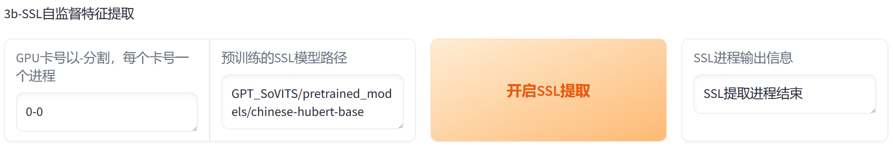

执行 **GPT_SoVITS/prepare_datasets/1-get-text.py**

执行 **GPT_SoVITS/prepare_datasets/2-get-hubert-wav32k.py**

`s1_train.py` 和 `s2_train.py` 的训练过程主要包括以下步骤：

1. `s1_train.py` 训练过程：
   - 初始化模型：使用 `Text2SemanticLightningModule` 类初始化模型，该类在其 `__init__` 方法中定义了模型的结构和训练逻辑。
   - 加载训练数据：使用 `Text2SemanticDataModule` 类加载和预处理训练数据。
   - 训练模型：在 `training_step` 方法中定义了每一步训练的过程，包括计算损失值、进行反向传播、更新模型参数等。
   - 记录训练信息：在 `training_step` 方法中，使用 `self.log` 方法记录了一些训练信息，如总损失、学习率和准确率。
   - 配置优化器和学习率调度器：在 `configure_optimizers` 方法中定义了优化器和学习率调度器的配置。

2. `s2_train.py` 训练过程：
   - 初始化模型：使用 `SynthesizerTrn` 和 `MultiPeriodDiscriminator` 类初始化生成器和判别器。
   - 加载训练数据：使用 `TextAudioSpeakerLoader` 类加载和预处理训练数据。
   - 训练模型：在 `run` 方法中定义了训练过程，包括初始化分布式训练环境、创建数据加载器、初始化模型和优化器、加载预训练模型、设置学习率调度器、进行训练循环等。
   - 在训练循环中，首先使用生成器和判别器计算损失值，然后进行反向传播和参数更新，最后记录训练信息和保存模型检查点。
   - 在每个训练周期结束时，可能会进行模型评估和学习率调整。